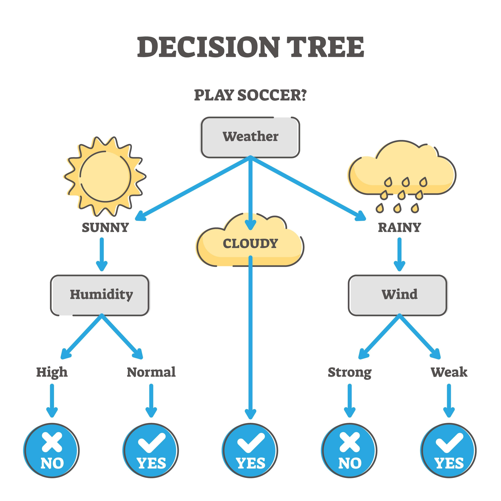

# 决策树

## 决策树的构建

线性回归和逻辑回归，底层都是基于严谨的**数学方程式**（通过寻找最优的权重参数来拟合数据）。而**决策树 (Decision Tree)** 则采取了一种截然不同的思路：它基于**逻辑规则**来进行分类或预测。

你可以把决策树想象成一个极其理性的“连问连答”系统，它非常符合人类做决策的直觉。



### 1. 决策树的基本结构

一棵决策树通常由以下几个部分组成：

-   **根节点 (Root Node)：** 树的顶端，包含了所有的初始数据。在这里，模型会提出第一个（也是区分度最大的）问题。
-   **内部节点 (Internal Nodes)：** 每一个内部节点代表对某个特征的一次测试（例如：“年龄是否大于30岁？”或“年收入是否超过10万？”）。
-   **分支 (Branches)：** 节点测试的结果（通常是“是”或“否”），它将引导数据流向下一个节点。
-   **叶节点 (Leaf Nodes)：** 树的末端，代表最终的预测结果（例如：分类问题中的“批准贷款”或“拒绝贷款”；回归问题中的某个具体数值）。

### 2. 核心问题：树是如何长出来的？

构建决策树的核心在于：**在每一个节点上，应该选择哪个特征进行分裂（Split）？**

决策树的贪心策略是：每次分裂都要让分出来的子集尽可能地**“纯” (Pure)**。

“纯”的意思是，分裂后的节点里，最好全都属于同一个类别（比如全是违约客户，或者全是优质客户）。为了衡量这种“纯度”，数学上引入了几个关键指标：

#### A. 基尼不纯度 (Gini Impurity) - 常用于 CART 算法

基尼不纯度衡量的是：从一个节点中随机抽取两个样本，它们的类别标签不一致的概率。基尼不纯度越低，节点的纯度越高。

对于包含 $K$ 个类别的节点，基尼不纯度的计算公式为：
$$
Gini = 1 - \sum_{k=1}^{K} p_k^2
$$
其中，$p_k$ 是该节点中属于第 $k$ 类的样本所占的比例。决策树会遍历所有特征的可能分裂点，选择能让**分裂后基尼不纯度下降最多**的那个特征。

#### B. 信息熵 (Entropy) & 信息增益 (Information Gain) - 常用于 ID3/C4.5 算法

信息熵是信息论中的概念，用来度量系统的混乱程度（不确定性）。熵越大，数据越混乱；熵越小，数据越纯。
$$
Entropy = -\sum_{k=1}^{K} p_k \log_2(p_k)
$$
模型会计算分裂前后的熵之差，也就是**信息增益**。信息增益最大的特征，就是当前最佳的分裂特征。

### 3. 决策树的优点与致命弱点

**优点：**

-   **极强的可解释性（白盒模型）：** 你可以把决策树的路径直接打印成 `if-else` 规则，非技术人员也能轻松看懂。
-   **数据准备工作量小：** 不需要像线性模型那样对数据进行归一化或标准化，它对数据的量纲不敏感。
-   **能同时处理数值型和类别型数据。**

**致命弱点：过拟合 (Overfitting)**

决策树有一种天生的“强迫症”。如果你不限制它，它会一直分裂下去，直到每一个叶节点里只有一个样本。这会导致一棵极其庞大且复杂的树，它完美地“死记硬背”了训练集中的每一个噪点，但面对新数据时预测能力极差。

此外，决策树非常**不稳定**，训练集哪怕发生一点点微小的变化，都可能导致整棵树的结构发生翻天覆地的改变。

### 4. 如何对付过拟合？

为了解决过拟合，我们通常会采取以下手段：

1.  **剪枝 (Pruning)：** * **预剪枝：** 在训练前设置规则，比如“树的深度最多不能超过 5 层”，或者“如果一个节点里的样本少于 10 个，就停止分裂”。
    -   **后剪枝：** 先让树长到最大，然后自底向上评估，如果剪掉某个枝节能提高模型的泛化能力，就把它剪掉。
2.  **集成学习 (Ensemble Learning)：** 既然一棵树容易犯错且不稳定，那就种一片“森林”。这就是后来演化出的大名鼎鼎的**随机森林 (Random Forest)** 和 **梯度提升树 (GBDT)** 的核心思想。

---

## 举例

这是一个非常好的问题。抛开抽象的理论，我们直接通过一个具体的、带点**量化交易色彩的“因子预测”小案例**，来一步步手工推导决策树是如何构建的。

假设我们收集了 6 天的股票数据，想预测**“明天股价是否会上涨”**。

我们提取了两个技术因子（特征）：

1.  **因子 1 (RSI_Oversold):** RSI 指标是否超卖（是/否）
2.  **因子 2 (MACD_Cross):** MACD 是否出现金叉（是/否）

**我们的历史数据集如下：**

| **样本 (天数)** | **RSI 超卖 (特征 1)** | **MACD 金叉 (特征 2)** | **明天上涨? (目标变量)** |
| --------------- | --------------------- | ---------------------- | ------------------------ |
| 第 1 天         | 是                    | 是                     | **是**                   |
| 第 2 天         | 是                    | 否                     | **是**                   |
| 第 3 天         | 否                    | 是                     | **是**                   |
| 第 4 天         | 否                    | 否                     | **否**                   |
| 第 5 天         | 是                    | 否                     | **是**                   |
| 第 6 天         | 否                    | 否                     | **否**                   |

现在，我们要用 **CART 算法（基于基尼不纯度 Gini Impurity）** 来构建这棵决策树。

### 第一步：计算分裂前的“根节点”基尼不纯度

在没有任何分类规则之前，这 6 天的数据混在一起。

-   总共 6 天：**4 天上涨（是），2 天下跌（否）**。

我们代入基尼不纯度的公式：$Gini = 1 - \sum p_k^2$
$$
Gini_{root} = 1 - \left(\frac{4}{6}\right)^2 - \left(\frac{2}{6}\right)^2 = 1 - \frac{16}{36} - \frac{4}{36} = \frac{16}{36} \approx 0.444
$$
这个 $0.444$ 就是我们目前的“混乱程度”。决策树的终极目标，就是通过提问，把这个数字降到 $0$。

### 第二步：评估所有的“提问”选项

决策树现在面临选择：是先按“RSI 超卖”来切分，还是先按“MACD 金叉”来切分？它会把两种情况都试算一遍。

#### 选项 A：用【RSI 超卖】作为第一个节点进行分裂

按照 RSI 是否超卖，数据被劈成了两半：

-   **左分支（RSI=是）：** 包含第 1, 2, 5 天。
    -   这 3 天里，**3 天都上涨，0 天下跌**。
    -   这个分支的基尼不纯度：$Gini_{左} = 1 - \left(\frac{3}{3}\right)^2 - 0 = 0$。
    -   *(太棒了，纯度 100%，这已经是一个完美的叶节点了！)*
-   **右分支（RSI=否）：** 包含第 3, 4, 6 天。
    -   这 3 天里，**1 天上涨（第3天），2 天下跌（第4,6天）**。
    -   这个分支的基尼不纯度：$Gini_{右} = 1 - \left(\frac{1}{3}\right)^2 - \left(\frac{2}{3}\right)^2 = 1 - \frac{1}{9} - \frac{4}{9} \approx 0.444$。

**计算选项 A 的加权基尼不纯度：**

由于左右分支的样本量都是 3 个（各占一半），我们要按比例加权求和：
$$
Gini_{RSI} = \frac{3}{6} \times 0 + \frac{3}{6} \times 0.444 = 0.222
$$

#### 选项 B：用【MACD 金叉】作为第一个节点进行分裂

按照 MACD 是否金叉，数据切分如下：

-   **左分支（MACD=是）：** 包含第 1, 3 天。
    -   这 2 天，**全部上涨**。
    -   $Gini_{左} = 1 - \left(\frac{2}{2}\right)^2 = 0$。
-   **右分支（MACD=否）：** 包含第 2, 4, 5, 6 天。
    -   这 4 天里，**2 天上涨（2,5），2 天下跌（4,6）**。
    -   $Gini_{右} = 1 - \left(\frac{2}{4}\right)^2 - \left(\frac{2}{4}\right)^2 = 1 - 0.25 - 0.25 = 0.5$。*(一半对一半，最混乱的状态)*

**计算选项 B 的加权基尼不纯度：**
$$
Gini_{MACD} = \frac{2}{6} \times 0 + \frac{4}{6} \times 0.5 \approx 0.333
$$

### 第三步：做出最终决定并继续生长

现在决策树会对比刚才试算的结果：

-   选 RSI 分裂，混乱度降到了 **0.222**
-   选 MACD 分裂，混乱度降到了 **0.333**

因为 $0.222 < 0.333$，**决策树决定：第一刀切在“RSI 超卖”上！** 这样带来的“纯度提升”（信息增益）最大。

**目前的树长这样：**

1.  问：RSI 是否超卖？
    -   如果是 -> 结论：**明天会涨**（叶节点，构建完成）。
    -   如果否 -> 数据还不够纯（包含 1 个涨，2 个跌）。

### 第四步：在不纯的分支上继续提问

对于“RSI=否”的这 3 个样本（第 3, 4, 6 天），我们继续用剩下的特征“MACD 金叉”来提问：

-   **如果 MACD=是（只有第 3 天）：** 明天上涨。纯度达到 100% ($Gini=0$)。
-   **如果 MACD=否（包含第 4, 6 天）：** 明天下跌。纯度也达到 100% ($Gini=0$)。

至此，所有的分支都达到了 100% 的纯度，决策树停止生长。

### 最终长成的模型规则：


```Plaintext
如果 RSI 超卖 == 是:
    预测: 明天上涨
如果 RSI 超卖 == 否:
    再看 MACD 金叉:
        如果 MACD 金叉 == 是:
            预测: 明天上涨
        如果 MACD 金叉 == 否:
            预测: 明天下跌
```

这就是决策树通过数学（基尼不纯度），一步一步推导出一套逻辑规则的完整过程。

---

## 基尼指数不为0时

在教科书的简单例子里，我们通常能把基尼不纯度降到 0（即叶节点达到 100% 的纯度）。但在真实的机器学习任务中，**无论怎么分割都无法将基尼不纯度降到 0，才是绝对的常态。**

遇到这种情况，决策树有一套非常成熟的处理机制。我们从“为什么降不到 0”以及“降不到 0 时怎么办”两个方面来拆解：

### 1. 为什么会降不到 0？

主要有两种原因导致我们永远无法（或不想）让节点的纯度达到 100%：

-   **数据存在“矛盾”与噪音 (特征耗尽)：** 假设我们有两条样本，它们的特征**完全一模一样**（比如 RSI 都是超卖，MACD 都是金叉），但是目标结果却截然相反（第一天涨了，第二天跌了）。

    既然特征已经没有任何区别了，决策树就再也找不到可以用来“提问”的切分点了。这种特征相同但标签不同的情况在现实中比比皆是。

-   **人为设定的“刹车” (预剪枝)：** 正如前面提到的，如果强行把树分裂到纯度为 100%，必然会导致严重的过拟合。因此，我们会设置停止条件，比如“当节点内的样本数少于 5 个时，停止分裂”，或者“树的深度达到 10 层时，停止生长”。一旦触发这些条件，即使当前节点的基尼不纯度大于 0，树也会立刻停止分裂。

### 2. 降不到 0 时，叶节点如何做决定？

当一个叶节点停止生长，但里面依然混合着不同类别的样本（比如有 7 个“涨”，3 个“跌”）时，决策树会采用以下规则来输出预测结果：

#### A. 分类问题：少数服从多数 (Majority Voting)

这是最直观的处理方式。模型会统计该叶节点中各类别的数量，**数量最多的那个类别，就是该叶节点的最终预测结果。**

-   **例子：** 叶节点里包含 7 个“涨”的样本，3 个“跌”的样本。当新数据落入这个叶节点时，模型会笃定地预测：**“涨”**。
-   那剩下的 3 个“跌”怎么办？它们就被当作了模型能够容忍的“误差”或“噪音”。

#### B. 输出概率值 (Probability)

相比于绝对的“非黑即白”，现代决策树（以及由它组成的森林）更倾向于输出一个概率值。它直接用叶节点中各个类别的占比作为预测概率。

-   **例子：** 同样是 7 个“涨”和 3 个“跌”。当新数据落入此节点时，模型不仅预测“涨”，还会告诉你：**预测上涨的概率是 70%，下跌的概率是 30%。**

#### C. 回归问题：取平均值 (Averaging)

如果你预测的不是离散的类别，而是连续的数值（比如预测明天的具体收益率是 1.5% 还是 -0.8%），那么当节点停止分裂且包含多个不同数值时，**该叶节点的预测结果就是这些数值的算术平均值。**

---

## 📝 机器学习进阶笔记：决策树的三大门派

为了让你一次性看懂这三个门派的区别，我们设定一个**极其简单的“挑西瓜”统一测试数据集**：
* **总数据 ($D$)**：6 个西瓜。其中 **4 个甜（好瓜），2 个不甜（坏瓜）**。
* **特征 A（颜色）**：深绿（4个，全甜），浅绿（2个，全不甜）。—— *（这是一个完美的特征）*
* **特征 B（西瓜编号）**：1 到 6 号，每个编号只有 1 个瓜。—— *（这是一个捣乱的废话特征）*

现在，我们让三大门派分别拿着自己的数学尺子，来衡量特征 A 和特征 B，看看它们会怎么选。

---

### 1. ID3 算法（尺子：信息增益 Information Gain）

**【核心思想】**：切分后，系统的“混乱度（熵）”下降了多少？下降得越多（增益越大），特征越好。

**【数学公式】**：
1. **系统的初始混乱度（信息熵 $H$）**：
   $$H(D) = - \sum p_k \log_2(p_k)$$
   *(其中 $p_k$ 是第 $k$ 类样本占总数的比例)*
2. **切分后的加权混乱度（条件熵 $H(D|A)$）**：
   $$H(D|A) = \sum \frac{|D^v|}{|D|} H(D^v)$$
   *(把每个分支的熵算出来，按数据量比例加权求和)*
3. **信息增益（Gain）**：
   $$Gain(D, A) = H(D) - H(D|A)$$

**【代入例子计算】**：
* **初始混乱度**：4甜2不甜，初始熵 $H(D) = -(\frac{4}{6}\log_2\frac{4}{6} + \frac{2}{6}\log_2\frac{2}{6}) \approx \mathbf{0.918}$
* **用“特征A (颜色)”切分**：
  * 深绿分支（4个全甜）：纯度100%，熵为 $0$。
  * 浅绿分支（2个全不甜）：纯度100%，熵为 $0$。
  * 切分后总混乱度 $H(D|A) = \frac{4}{6} \times 0 + \frac{2}{6} \times 0 = \mathbf{0}$。
  * **特征A的信息增益** = $0.918 - 0 = \mathbf{0.918}$。
* **用“特征B (编号)”切分**：
  * 切出了 6 个分支，每个分支只有 1 个瓜。因为单个瓜纯度是 100%，所以 6 个分支的熵全都是 $0$！
  * 切分后总混乱度 $H(D|B) = \mathbf{0}$。
  * **特征B的信息增益** = $0.918 - 0 = \mathbf{0.918}$。

**【ID3 总结】**：

在 ID3 眼里，**完美的“颜色”和捣乱的“编号”，信息增益居然是一样大的（都是 0.918）！** 如果西瓜有 100 个，编号切出 100 个分支，ID3 会盲目地认为“编号”是世界上最好的特征。这就是 ID3 **严重偏向分支多（取值多）的特征**的致命缺陷。 

---

### 2. C4.5 算法（尺子：信息增益率 Information Gain Ratio）

**【核心思想】**：你分支多是吧？我专门设计一个“惩罚项”，你分支越多，我把你除得越小！

**【数学公式】**：
1. **惩罚项（固有值 Intrinsic Value, $IV$）**：
   $$IV(A) = - \sum \frac{|D^v|}{|D|} \log_2 \left( \frac{|D^v|}{|D|} \right)$$
   *(注意看，它算的不是类别的熵，而是**特征分支数量**的熵。分支越多，分布越散，$IV$ 越大)*
2. **信息增益率（Gain_Ratio）**：
   $$Gain\_Ratio(D, A) = \frac{Gain(D, A)}{IV(A)}$$

**【代入例子计算】**：
* **评估“特征A (颜色)”**：分为 2 个分支（占比 $\frac{4}{6}$ 和 $\frac{2}{6}$）。
  惩罚项 $IV(A) = -(\frac{4}{6}\log_2\frac{4}{6} + \frac{2}{6}\log_2\frac{2}{6}) \approx \mathbf{0.918}$
  **增益率** = $\frac{0.918}{0.918} = \mathbf{1.0}$
* **评估“特征B (编号)”**：分为 6 个分支（每个占比 $\frac{1}{6}$）。
  惩罚项 $IV(B) = - (6 \times \frac{1}{6}\log_2\frac{1}{6}) = \log_2 6 \approx \mathbf{2.585}$ *(极大的惩罚！)*
  **增益率** = $\frac{0.918}{2.585} \approx \mathbf{0.355}$

**【C4.5 总结】**：
C4.5 加上分母惩罚后，捣乱的“编号”得分瞬间从 0.918 暴跌到 **0.355**，而真正有用的“颜色”得分为 **1.0**。C4.5 完美识破了“编号”的伪装，成功选出了最优特征。

---

### 3. CART 算法（尺子：基尼指数 Gini Index）

**【核心思想】**：算 $\log$ 对数太慢了！我直接算平方。而且我强制规定，**每次只能切 2 刀（二叉树）**，这样结构最简单，速度最快。Gini 值越小，代表数据越纯粹。

**【数学公式】**：
1. **单一数据集的基尼值（Gini）**：
   $$Gini(D) = 1 - \sum p_k^2$$
   *(不用算 log 了，直接算占比的平方和，再被 1 减)*
2. **切分后的基尼指数（Gini_Index）**：因为 CART 是绝对的二叉树，所以永远只有 2 个分支（$D_1$ 和 $D_2$）。
   $$Gini\_Index(D, A) = \frac{|D_1|}{|D|} Gini(D_1) + \frac{|D_2|}{|D|} Gini(D_2)$$

**【代入例子计算】**：
* **初始基尼值**：4甜2不甜。 $Gini(D) = 1 - (\frac{4}{6})^2 - (\frac{2}{6})^2 = 1 - \frac{16}{36} - \frac{4}{36} = \frac{16}{36} \approx \mathbf{0.444}$
* **用“特征A (颜色)”切分**（直接分两拨）：
  * 深绿分支（4全甜）：$Gini(D_1) = 1 - 1^2 - 0^2 = 0$
  * 浅绿分支（2全不甜）：$Gini(D_2) = 1 - 0^2 - 1^2 = 0$
  * **特征A的基尼指数** = $\frac{4}{6} \times 0 + \frac{2}{6} \times 0 = \mathbf{0}$ *(达到了极小值，完美！)*
* **用“特征B (编号)”切分**（注意，CART 强制二叉，不能切 6 份！它只能像这样问：“编号是不是 1？”）：
  * 左边（编号是1，共1个瓜）：$Gini(D_1) = 0$
  * 右边（编号非1，共5个瓜：可能3甜2不甜）：$Gini(D_2) = 1 - (\frac{3}{5})^2 - (\frac{2}{5})^2 = 0.48$
  * **这种切法的基尼指数** = $\frac{1}{6} \times 0 + \frac{5}{6} \times 0.48 = \mathbf{0.4}$

**【CART 总结】**：
CART 通过强制的二叉提问（“是”或“不是”），彻底消灭了“切出无数个碎渣分支”的可能性。同时，它用简单的平方运算 $p^2$ 替代了对数 $\log_2(p)$，极大地压榨了计算机的算力。它选出的最优特征依然是基尼指数为 $0$ 的“颜色”。

---

### 📊 三大门派终极对比速查表

| 特性 | ID3 | C4.5 | CART |
| :--- | :--- | :--- | :--- |
| **选择尺子 (分类)** | 信息增益 (最大化) | 信息增益率 (最大化) | 基尼指数 Gini (最小化) |
| **回归能力** | ❌ 无法做回归 | ❌ 无法做回归 | ✅ 均方误差 (MSE最小化) |
| **树的形状** | 多叉树 | 多叉树 | **绝对的二叉树** |
| **连续数值处理** | ❌ 不支持 | ✅ 支持 (寻找切分点) | ✅ 支持 |
| **缺失值处理** | ❌ 不支持 | ✅ 支持 | ✅ 支持 |
| **计算速度** | 慢 (有 log 运算) | 最慢 (有 log 运算 + 惩罚项) | **极快** (仅加减乘除) |

---

这三个算法的演进路线其实就是一部“打怪升级史”：
**ID3 发现了思路 $\rightarrow$ C4.5 修了 Bug $\rightarrow$ CART 极致优化了性能与结构。**


