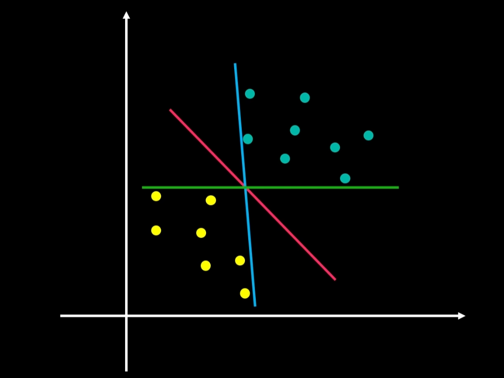
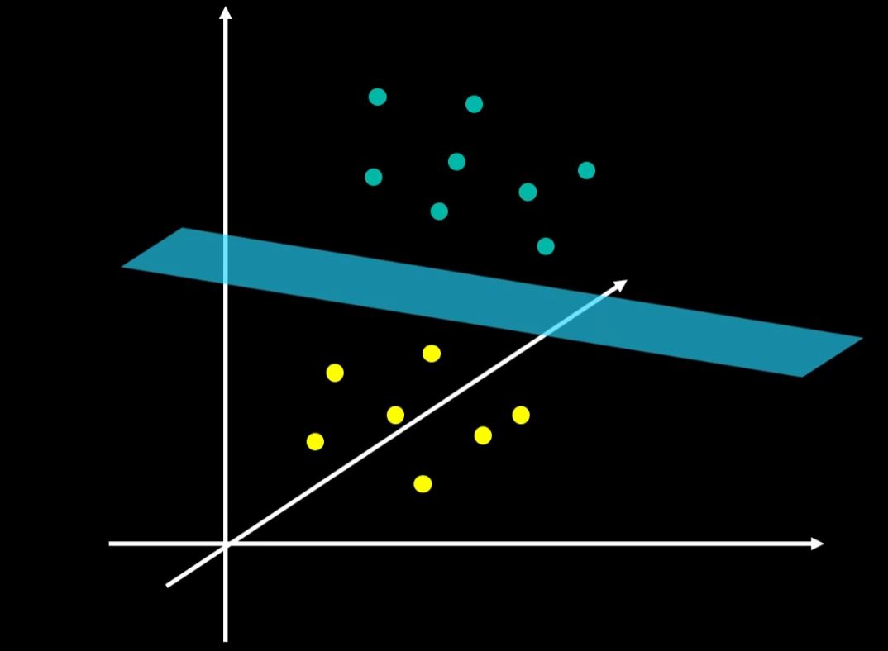
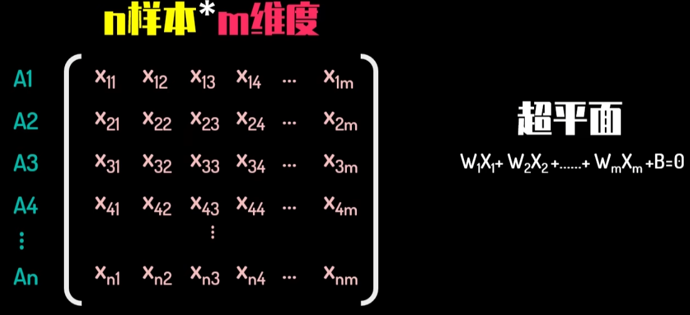
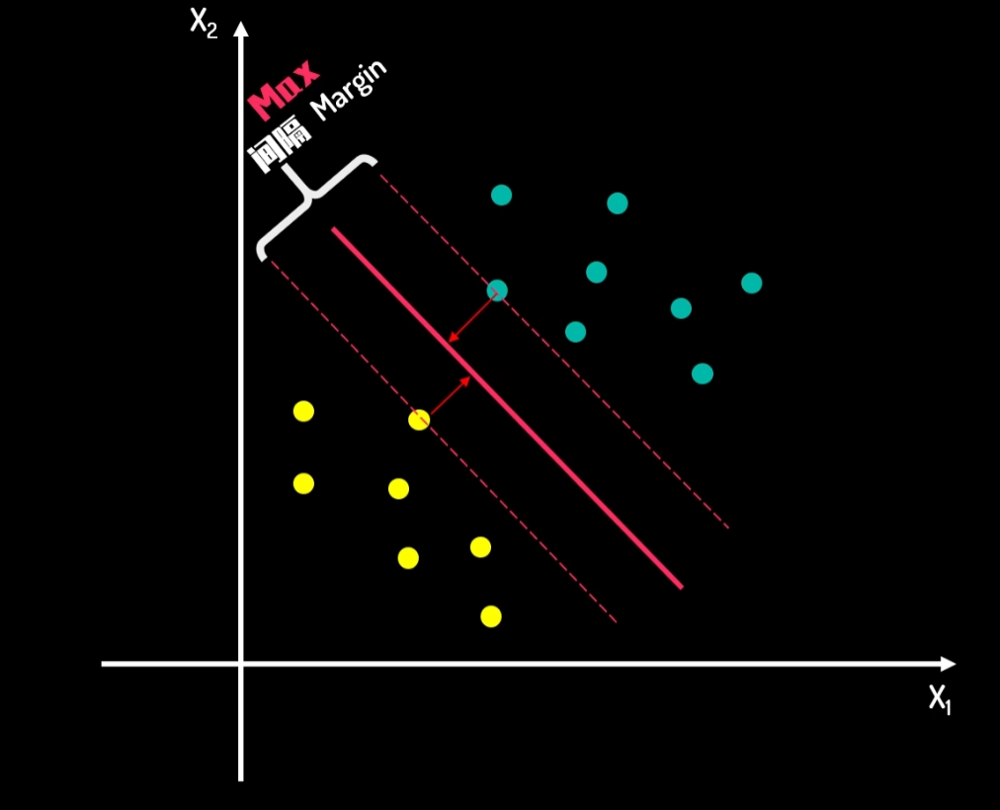
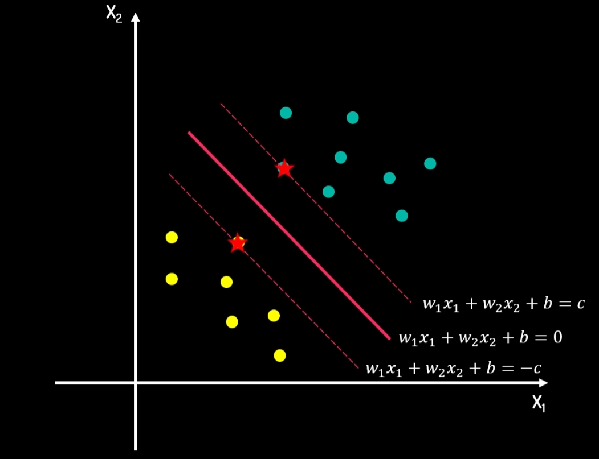
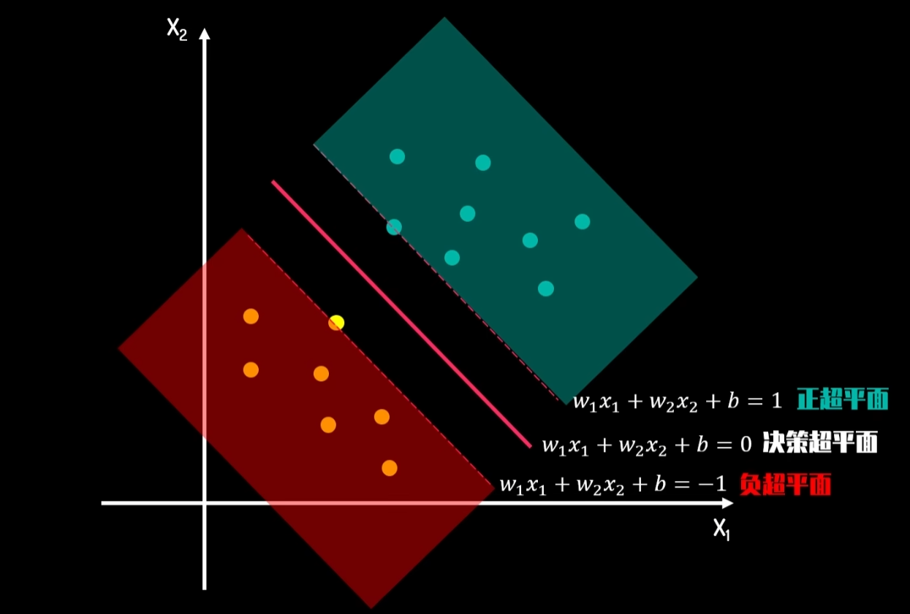
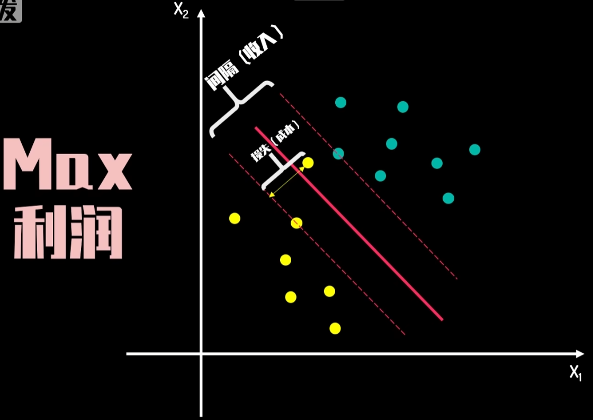
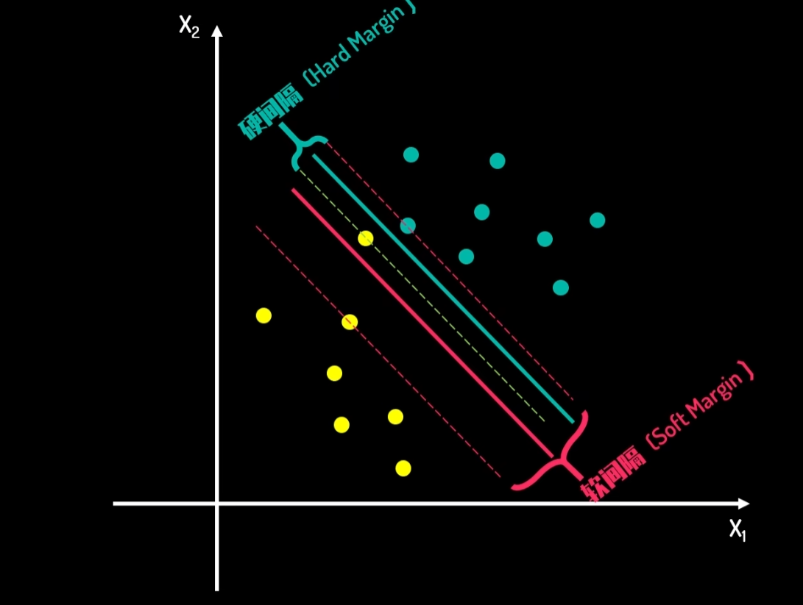
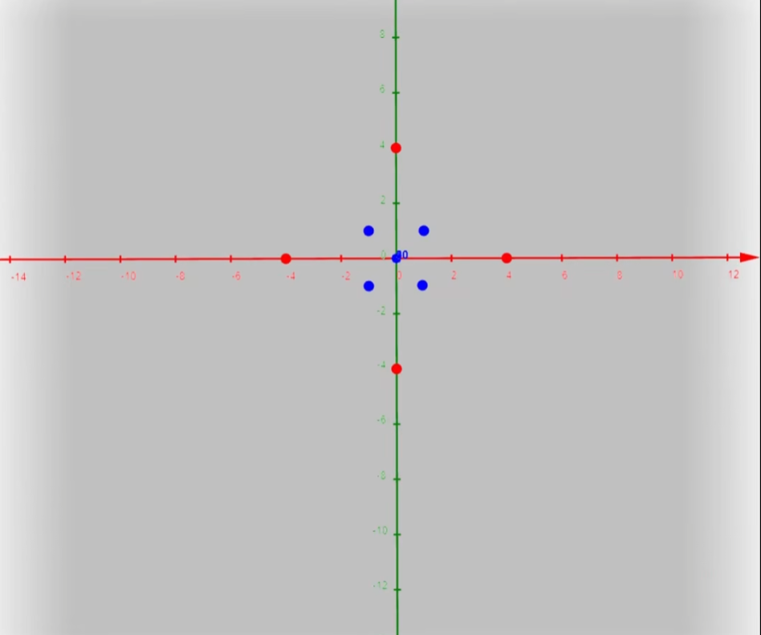
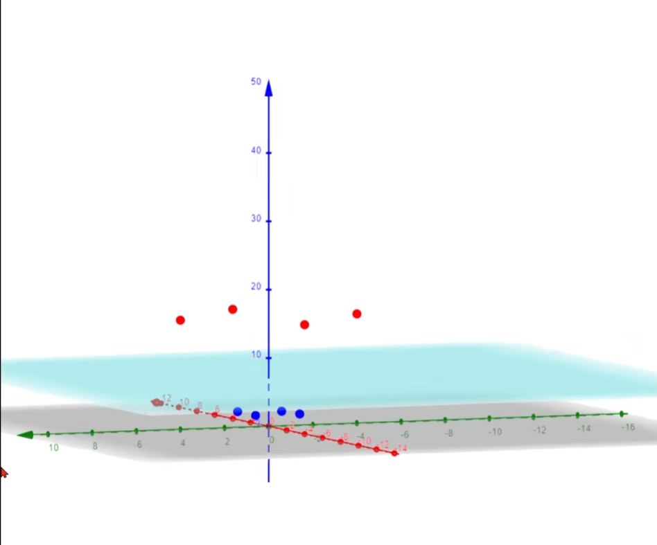

# 支持向量机

视频：[【数之道】支持向量机SVM是什么，八分钟直觉理解其本质_哔哩哔哩_bilibili](https://www.bilibili.com/video/BV16T4y1y7qj/?spm_id_from=333.337.search-card.all.click&vd_source=958633e12684eb6031a43772ebfbd213)

## 一、支持向量机要解决的问题

分类问题：如何用一条直线吧小球分类

将问题抽象 -> 如何用一维将一个二维空间分成两类、如何用二维将三维空间分为两类

将问题推广到高维：如何用`n-1`的超平面将`n`维度空间分为两类

## 二、直观理解支持向量机(SVM)

### 间隔和决策边界

以二维为例，我们要找到一个最好的划分方法，也就是我们要找一条 $y=ax+b$，这条直线被成为**决策边界**，一个好的**决策边界**应该让**间隔最大**，这样才能保证，如果有新的点插入，那么这条决策边界依然能够正常工作。因此，寻找决策边界问题，**被转化为寻找最大间隔问题，间隔的正中，就是决策边界。**

接下来我们来量化一下我们的间隔和决策边界，我们让决策边界为向量 $w_1x_1+w_2x_2+b=0$，**将决策边界向上平移C和向下平移C**，于是我们得到间隔的表达式子，如下图所示。而被上下平移c所经过的点就被我们成为**支持向量**。

我们把这三个式子联立起来，并且让等式两边同时除以c得到如下表达式：
$$
\begin{cases}
w_1 x_1 + w_2 x_2 + b = c \\
w_1 x_1 + w_2 x_2 + b = 0 \\
w_1 x_1 + w_2 x_2 + b = -c
\end{cases}
\quad \Rightarrow \quad
\begin{cases}
\frac{w_1}{c} x_1 + \frac{w_2}{c} x_2 + \frac{b}{c} = 1 \\[4pt]
\frac{w_1}{c} x_1 + \frac{w_2}{c} x_2 + \frac{b}{c} = 0 \\[4pt]
\frac{w_1}{c} x_1 + \frac{w_2}{c} x_2 + \frac{b}{c} = -1
\end{cases}
\tag{1}
$$
我们令：
$$
\begin{cases}
w^{'}_1=\frac{w_1}{c} \\
w^{'}_2=\frac{w_2}{c} \\
b^{'}=\frac{b}{c}
\end{cases}\tag{2}
$$
因此将`(2)`式带入到`(1)`式中，我们得到如下表达式，求解$w^{'}$和求解$w$对于我们来说并没有区别，因此我们将$w^{'}$和$b^{'}$，换为$w$和$b$。
$$
\left\{
\begin{aligned}
w'_1 x_1 + w'_2 x_2 + b' &= 1 \\
w'_1 x_1 + w'_2 x_2 + b' &= 0 \\
w'_1 x_1 + w'_2 x_2 + b' &= -1
\end{aligned}
\right.
\quad \longrightarrow \quad
\left\{
\begin{aligned}
w_1 x_1 + w_2 x_2 + b &= 1 \\
w_1 x_1 + w_2 x_2 + b &= 0 \\
w_1 x_1 + w_2 x_2 + b &= -1
\end{aligned}
\right.\tag{3}
$$

### 正负超平面和决策超平面

**决策边界就是决策超平面**

### 损失

损失的引入是因为样本不会是一番风顺的，如果总会有一些样本，我们难以分类，或者分类之后，我们得到的间隔太小，导致模型鲁棒性太差，因此，**我们的目标不是在样本中找到最佳分类，而是找到的这个分类**，**在非样本集中** **（测试集）有很好的表现**，因此，我们需要适当的忽略一些样本点，**这些样本点可能被我们错误的分类**，**这些错误的** **分类就是损失。**我们的目标是**综合考虑损失和间隔，让损失最小，让间隔最大。**

### 软间隔和硬间隔

### 升维（维度转换）

在一些例子中，我们在`n`维空间中很难对样本进行分类，因此我们会尝试增加一个维度，将样本空间增加到`n+1`维，这个时候，样本往往比`n`维好分类。

>   升维的思想在其他领域也有体现，例如在计算机图形学领域，仿射变换为了统一平移和旋转，便增加了一个维度，使得平移变化也能够用矩阵统一。

例如，在下面这个例子中，我们使用二维往往很难进行分类：

但是在3维空间中，我们往往能够得到很好的分类效果：

我们写为矩阵形式如下：
$$
\begin{pmatrix}
x_{11} & x_{12} \\
x_{21} & x_{22} \\
x_{31} & x_{32} \\
x_{41} & x_{42} \\
\vdots & \vdots \\
x_{n1} & x_{n2}
\end{pmatrix}
\xrightarrow{T(x)}
\begin{pmatrix}
x_{11} & x_{12} & x_{13} & x_{14} & \cdots & x_{1m} \\
x_{21} & x_{22} & x_{23} & x_{24} & \cdots & x_{2m} \\
x_{31} & x_{32} & x_{33} & x_{34} & \cdots & x_{3m} \\
x_{41} & x_{42} & x_{43} & x_{44} & \cdots & x_{4m} \\
\vdots & \vdots & \vdots & \vdots & \ddots & \vdots \\
x_{n1} & x_{n2} & x_{n3} & x_{n4} & \cdots & x_{nm}
\end{pmatrix}
\quad \xrightarrow{} \quad
W_1 X_1 + W_2 X_2 + \cdots + W_m X_m + B = 0
\tag{4}
$$

$$
\begin{pmatrix}
x'_1 & x'_2
\end{pmatrix}
\xrightarrow{T(x)}
\begin{pmatrix}
x'_1 & x'_2 & x'_3 & x'_4 & \cdots & x'_m
\end{pmatrix}
\quad \xrightarrow{} \quad
W_1 X_1 + W_2 X_2 + \cdots + W_m X_m + B = 0
\tag{5}
$$

**如果我们不想将数据送到高维去计算，就需要运用Kernel Trick（核技巧）**，核技巧会在后续章节进行介绍。

