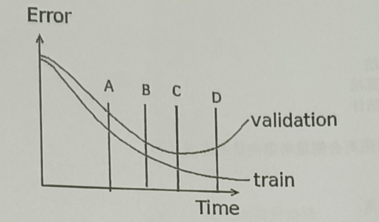

# 机器学习选择题题库

<!-- TOC START -->
## 目录

- <a href="#toc-0001">📝 机器学习基础考点笔记（一）</a>
  - <a href="#toc-0002">第1题</a>
  - <a href="#toc-0003">第2题</a>
  - <a href="#toc-0004">第3题</a>
  - <a href="#toc-0005">第4题</a>
  - <a href="#toc-0006">第5题</a>
  - <a href="#toc-0007">第6题</a>
  - <a href="#toc-0008">第7题</a>
- <a href="#toc-0009">📝 机器学习基础考点笔记（二）</a>
  - <a href="#toc-0010">第8题</a>
  - <a href="#toc-0011">第9题</a>
  - <a href="#toc-0012">第10题</a>
  - <a href="#toc-0013">第11题</a>
  - <a href="#toc-0014">第12题</a>
  - <a href="#toc-0015">第13题</a>
  - <a href="#toc-0016">第14题</a>
- <a href="#toc-0017">📝 机器学习基础考点笔记（三）</a>
  - <a href="#toc-0018">第15题</a>
  - <a href="#toc-0019">第16题</a>
  - <a href="#toc-0020">第17题</a>
  - <a href="#toc-0021">第18题</a>
  - <a href="#toc-0022">第19题 & 第20题 （这两题可以合并理解）</a>
  - <a href="#toc-0023">第21题</a>
- <a href="#toc-0024">📝 机器学习基础考点笔记（四）</a>
  - <a href="#toc-0025">第22题</a>
  - <a href="#toc-0026">第23题</a>
  - <a href="#toc-0027">第24题</a>
  - <a href="#toc-0028">第25题</a>
  - <a href="#toc-0029">第26题</a>
  - <a href="#toc-0030">第27题</a>
  - <a href="#toc-0031">第28题</a>
- <a href="#toc-0032">📝 机器学习基础考点笔记（五）</a>
  - <a href="#toc-0033">第29题</a>
  - <a href="#toc-0034">第30题</a>
  - <a href="#toc-0035">第31题</a>
  - <a href="#toc-0036">第32题</a>
  - <a href="#toc-0037">第33题</a>
  - <a href="#toc-0038">第34题</a>
  - <a href="#toc-0039">第35题</a>
- <a href="#toc-0040">📝 机器学习基础考点笔记（六）</a>
  - <a href="#toc-0041">第36题</a>
  - <a href="#toc-0042">第37题</a>
  - <a href="#toc-0043">第38题</a>
  - <a href="#toc-0044">第39题 & 第40题 （这两题必须绑在一起看！）</a>
  - <a href="#toc-0045">第41题</a>
  - <a href="#toc-0046">第42题 & 第43题（信息论巅峰对决：最大熵原理）</a>
- <a href="#toc-0047">📝 机器学习基础考点笔记（七）</a>
  - <a href="#toc-0048">第44题</a>
  - <a href="#toc-0049">第45题（⚠️硬核防坑题）</a>
  - <a href="#toc-0050">第46题</a>
  - <a href="#toc-0051">第47题</a>
  - <a href="#toc-0052">第48题</a>
- <a href="#toc-0053">📝 机器学习基础考点笔记（八）</a>
  - <a href="#toc-0054">第49题</a>
  - <a href="#toc-0055">第50题</a>
  - <a href="#toc-0056">第51题（⚠️超级经典陷阱题）</a>
  - <a href="#toc-0057">第52题</a>
  - <a href="#toc-0058">第53题</a>
  - <a href="#toc-0059">第54题</a>
- <a href="#toc-0060">📝 机器学习基础考点笔记（九）</a>
  - <a href="#toc-0061">第55题（补充题干）</a>
  - <a href="#toc-0062">第56题（⚠️高频硬核考点）</a>
  - <a href="#toc-0063">第57题</a>
  - <a href="#toc-0064">第58题</a>
  - <a href="#toc-0065">第59题</a>
  - <a href="#toc-0066">第60题</a>
  - <a href="#toc-0067">第61题</a>
- <a href="#toc-0068">📝 机器学习基础考点笔记（十）</a>
  - <a href="#toc-0069">第62题</a>
  - <a href="#toc-0070">第63题</a>
  - <a href="#toc-0071">第64题</a>
  - <a href="#toc-0072">第65题（⚠️披着算法外衣的初中几何题）</a>
  - <a href="#toc-0073">第66题</a>
  - <a href="#toc-0074">第67题</a>
  - <a href="#toc-0075">第68题</a>
- <a href="#toc-0076">📝 机器学习基础考点笔记（十一）</a>
  - <a href="#toc-0077">第69题</a>
  - <a href="#toc-0078">第70题</a>
  - <a href="#toc-0079">第71题</a>
  - <a href="#toc-0080">第72题（💡极佳的集成学习思维题）</a>
  - <a href="#toc-0081">第73题</a>
  - <a href="#toc-0082">第74题</a>
- <a href="#toc-0083">📝 机器学习基础考点笔记（十二）</a>
  - <a href="#toc-0084">第75题（补充题干）</a>
  - <a href="#toc-0085">第76题</a>
  - <a href="#toc-0086">第77题</a>
  - <a href="#toc-0087">第78题</a>
  - <a href="#toc-0088">第79题</a>
  - <a href="#toc-0089">第80题</a>
- <a href="#toc-0090">📝 机器学习基础考点笔记（十三 · 完结篇）</a>
  - <a href="#toc-0091">第81题</a>
  - <a href="#toc-0092">第82题</a>
  - <a href="#toc-0093">第83题</a>
  - <a href="#toc-0094">第84题</a>
  - <a href="#toc-0095">第85题（大轴题）</a>

<!-- TOC END -->

---

### 📝 机器学习基础考点笔记（一）

#### 第1题
**【原题呈现】**
属于监督学习的机器学习算法是（ A ）
A. 贝叶斯分类器
B. 主成分分析
C. K-Means
D. 高斯混合聚类

**【知识点扫盲】**
机器学习最基本的两大门派就是“监督学习”和“无监督学习”。
* **监督学习（有老师教）**：不仅给你看题目（数据特征），还直接把标准答案（标签 Label）给你，让你照着学。比如给你一堆猫和狗的照片，且明确标出了哪张是猫、哪张是狗，让你训练一个能认出猫狗的模型。
* **无监督学习（没老师教）**：只给你一堆题目（数据），没有任何标准答案。你需要自己去发现数据里的规律。比如给你一堆没有标记的硬币，你通过观察发现可以按大小分成两堆，这就叫“聚类”。

**【选项逐一拆解】**
* **A选项（贝叶斯分类器）**：既然是“分类器”，肯定得先知道有哪些类别（答案）存在，才能去算概率。所以它依赖带标签的数据，是**监督学习**。
* **B选项（主成分分析 PCA）**：它的任务是把复杂的高维数据“压缩”成低维数据（降维），这个过程完全不关心数据到底属于哪一类，不需要标签，是**无监督学习**。
* **C选项（K-Means）**：经典的“物以类聚”算法，自己根据距离远近把数据抱团，不需要提前给标签，是**无监督学习**。
* **D选项（高斯混合聚类 GMM）**：本质上也是用来做聚类的，只是换了种数学逻辑，同样不需要标签，是**无监督学习**。

**【一句话总结】**
只要名字里带“分类”或“回归”的，绝大多数都是监督学习；名字带“聚类”或“降维”的，基本都是无监督学习。

---

#### 第2题
**【原题呈现】**
属于无监督学习的机器学习算法是（ C ）
A. 支持向量机
B. Logistic回归
C. 层次聚类
D. 决策树

**【知识点扫盲】**
这题和第1题是反着考的，测试你是否真正理解了刚才的分类逻辑。我们直接找那个“不需要提前给标准答案”的算法。

**【选项逐一拆解】**
* **A选项（支持向量机 SVM）**：要在不同类别之间画一条“最宽的楚河汉界”，画界线的前提是得知道谁是楚、谁是汉（需要标签），属于**监督学习**。
* **B选项（Logistic回归）**：虽然叫回归，但其实是个干分类的活儿（比如预测明天股票是涨还是跌），需要历史涨跌标签来训练，属于**监督学习**。
* **C选项（层次聚类）**：看名字就知道是聚类，一层一层地把相似的样本合并，完全不需要提前知道标签，属于**无监督学习**。正确。
* **D选项（决策树）**：像玩“猜猜我是谁”游戏一样，通过不断提问（比如“有翅膀吗？”“会飞吗？”）来确定最终类别。提问的依据来自于已知标签的数据，属于**监督学习**。

**【一句话总结】**
找无监督学习，就盯准“聚类（Clustering）”和“降维（Dimensionality Reduction）”这两个关键词。

---

#### 第3题
**【原题呈现】**
二项式分布的共轭分布是（ C ）
A. 正态分布
B. Dirichlet分布
C. Beta分布
D. 指数分布

**【知识点扫盲】**
“共轭分布”听起来特别高深，其实你可以把它理解为数学里的**“家族遗传基因”**。
在贝叶斯推断里，如果你原本的猜测（先验）和新看到的数据（似然）一结合，得出的新结论（后验）在形状上跟你的猜测属于**同一个概率家族**，我们就说它俩“共轭”。这在写代码和做数学推导时能省去极大的计算量。
二项分布描述的是“非黑即白”的事情（比如抛硬币是正是反），属于离散的计数。

**【选项逐一拆解】**
* **A选项（正态分布）**：正态分布的共轭先验是它自己（正态分布），它们是一家人。
* **B选项（Dirichlet分布）**：这是留给更复杂的多项式分布的（见下一题）。
* **C选项（Beta分布）**：**正确**。Beta 分布天生就是用来给“二项分布”做先验的。它们是一对经典CP。
* **D选项（指数分布）**：通常用来描述时间间隔（比如等公交车），跟这俩没关系。

**【一句话总结】**
死记硬背考研必考CP：**二项分布 $\leftrightarrow$ Beta 分布** （抛硬币专属组合）。

---

#### 第4题
**【原题呈现】**
多项式分布的共轭分布是（ B ）
A. 正态分布
B. Dirichlet分布
C. Beta分布
D. 指数分布

**【知识点扫盲】**
这题是第3题的进阶版。
刚才的二项分布是“抛硬币”（只有两面），现在多项式分布变成了“掷骰子”（有多个面，多种可能结果）。既然事情变复杂了，给它配对的“共轭先验”也得跟着升维。

**【选项逐一拆解】**
* **B选项（Dirichlet分布）**：**正确**。Dirichlet 分布其实就是 Beta 分布的高维扩大版。既然掷骰子是抛硬币的扩大版，那 Dirichlet 分布自然就是多项式分布的最佳 CP。
* （其他选项解析同第3题，不再赘述）

**【一句话总结】**
死记硬背考研必考CP：**多项分布 $\leftrightarrow$ Dirichlet（狄利克雷）分布** （掷骰子专属组合）。

---

#### 第5题
**【原题呈现】**
朴素贝叶斯分类器的特点是（ C ）
A. 假设样本服从正态分布
B. 假设样本服从多项式分布
C. 假设样本各维属性独立
D. 假设样本各维属性存在依赖

**【知识点扫盲】**
为什么叫它“朴素（Naive）”？因为它把这个世界想得太简单了。
现实中，事物特征往往是有关联的。比如在文本里，“计算机”和“科学”这两个词大概率会一起出现。但如果去算这种复杂的关联概率，计算量会大到计算机直接宕机。
于是，朴素贝叶斯强行耍赖：**“我不管，我假设所有的特征之间毫无关系，互不影响！”** 这样就可以把复杂的联合概率，简单粗暴地变成各个特征单独概率的连乘积。

**【选项逐一拆解】**
* **A/B选项**：虽然有高斯朴素贝叶斯（用正态分布）和多项式朴素贝叶斯，但那只是针对不同数据的变体，不是整个算法最核心的共同特点。
* **C选项（各维属性独立）**：**正确**。这就是“朴素”这两个字在数学上的唯一解释，也是这个算法能跑得这么快的核心机密。
* **D选项（属性存在依赖）**：这是它的对立面。如果考虑依赖关系，那就变成更高级、也更难算的“贝叶斯网络”了。

**【一句话总结】**
看到“朴素贝叶斯”，脑子里条件反射弹出八个大字：**条件独立，简单粗暴**。

---

#### 第6题
**【原题呈现】**
下列方法中没有考虑先验分布的是（ D ）
A. 最大后验估计
B. 贝叶斯分类器
C. 贝叶斯学习
D. 最大似然估计

**【知识点扫盲】**
统计学里有两大水火不容的门派：
1.  **频率学派**：只相信眼前看到的数据，讲究“眼见为实”。我不听你以前的经验，我现在做实验看到啥概率就是啥概率。
2.  **贝叶斯学派**：认为经验很重要，讲究“结合经验看数据”。先有一个主观的初始判断（这叫**先验分布**），然后再根据新看到的数据去调整这个判断。

**【选项逐一拆解】**
* **A、B、C选项**：名字里带“贝叶斯”或者“后验（Posterior）”的，都是贝叶斯学派的招式。它们计算时一定、必须、绝对要加上那个代表经验的“先验分布”。
* **D选项（最大似然估计 MLE）**：**正确**。这是频率学派的看家本领。似然（Likelihood）指的就是当前数据发生的可能性，它完全不考虑历史经验（先验），只追求让眼前这批数据出现概率最大的那个参数。

**【一句话总结】**
最大似然（MLE）= 频率学派 = 只看眼前，没有先验。

---

#### 第7题
**【原题呈现】**
对于正态密度的贝叶斯分类器，各类协方差矩阵相同时，决策函数为（ A ）
A. 线性决策函数
B. 非线性决策函数
C. 最小距离分类器
D. 以上都有可能

**【知识点扫盲】**
把数据想象成天上飘着的两坨云。
“协方差矩阵相同”，意思是这两坨云的“形状”和“大小”一模一样，只是飘在天空中的位置（中心点）不同。
既然两坨云形状完全一样，那在它们中间划一条明确的楚河汉界，这条界线最自然的状态就是一条笔直的线（或者平整的面）。

**【选项逐一拆解】**
* **A选项（线性决策函数）**：**正确**。数学上，当协方差矩阵相同时，判别公式里那些复杂的平方项（二次项）就会被直接抵消掉，只剩下一次项，画出来的图就是一条直线。
* **B选项（非线性）**：如果一坨云是圆的，另一坨被拉长成了扁的（协方差矩阵不同），为了把它们分开，界线就会弯曲，变成二次曲线（非线性）。
* **C选项（最小距离）**：这是比线性更极端的情况。不仅两坨云形状一样，而且还得是完美的“正球体”（各个维度绝对独立且方差都为1），直线才会退化成纯粹看谁离中心点更近。条件太苛刻，不能选。

**【一句话总结】**
形状相同（协方差相等） $\rightarrow$ 边界是直的（线性）。
形状不同（协方差不等） $\rightarrow$ 边界是弯的（非线性/二次）。

---

### 📝 机器学习基础考点笔记（二）

#### 第8题
**【原题呈现】**
下列属于线性分类方法的是（ B ）
A. 决策树
B. 感知机
C. 最近邻
D. 集成学习

**【知识点扫盲】**
什么是“线性分类”？
你可以把数据想象成桌子上散落的红豆和绿豆。如果你能**用一把直尺（一条笔直的直线，或者空间里的一个平整的切面）**，一刀切下去，把红豆和绿豆完美分开，这种方法就叫“线性分类”。
如果红豆和绿豆混成了太极图的形状，直尺切不开，必须画曲线或者拐弯的线，那就是“非线性分类”。

**【选项逐一拆解】**
* **A选项（决策树）**：它是通过不断画框框（比如大于某个值走左边，小于走右边）来分类的，画出来的边界像阶梯一样，是折线，属于**非线性**。
* **B选项（感知机）**：**正确**。它是神经网络的“老祖宗”，功能极其单一，就是在空间里画一条笔直的线（$y = wx + b$）去切分数据。如果数据切不开，它就直接死循环报错。它是最纯粹的**线性分类器**。
* **C选项（最近邻 KNN）**：它不画线，只看周围邻居是谁。它的分类边界是由一个个多边形拼接而成的（泰森多边形），极其复杂和弯曲，属于**非线性**。
* **D选项（集成学习）**：这是把多个小模型组合成一个大模型（比如随机森林）。组合后的力量极其强大，能拟合各种奇形怪状的边界，妥妥的**非线性**。

**【一句话总结】**
感知机（Perceptron）是最老牌的“画直线”机器，纯正的线性分类器。

---

#### 第9题
**【原题呈现】**
下列方法不受数据归一化影响的是（ D ）
A. SVM
B. 神经网络
C. Logistic回归
D. 决策树

**【知识点扫盲】**
什么是“归一化（Normalization）”？
假设我们要根据人的“身高（毫米）”和“体重（公斤）”来预测健康。身高动不动就是 1700、1800，而体重只有 60、70。如果直接让计算机算距离，1700 这么大的数字会把 60 的影响力彻底掩盖掉。
所以，我们需要把所有数据都按比例缩放到同一个小范围内（比如 0 到 1 之间），大家平起平坐，这就叫归一化。

那为什么有的算法不需要呢？**因为它们根本不关心具体的数值差异，只关心数据的“排位顺序”。**

**【选项逐一拆解】**
* **A选项（SVM）**：SVM 的核心是算数据点到边界的“几何距离”。只要算距离，就必须归一化，否则大数值特征会主导一切。
* **B & C选项（神经网络、Logistic回归）**：它们需要一步步“试探”最优解（梯度下降）。如果不归一化，整个试探的过程会在大数值的方向上疯狂震荡，半天找不到最低点。
* **D选项（决策树）**：**正确**。决策树是怎么干活的？它只问类似“身高是否大于 1600？”这样的问题。不管你把身高换算成米、厘米还是微米，只要“张三比李四高”这个**排序规律**不变，决策树切分出来的结果就一模一样。所以它完全免疫数值缩放。

**【一句话总结】**
基于空间距离和梯度的算法必须归一化；基于规则和排序的算法（树模型）不需要归一化。

---

#### 第10题
**【原题呈现】**
下列分类方法中不会用到梯度下降法的是（ C ）
A. 感知机
B. 最小二乘分类器
C. 最小距离分类器
D. Logistic回归

**【知识点扫盲】**
什么是“梯度下降法”？
想象你被蒙住双眼扔在一座大山上，你要找最低的山谷。你只能用脚探一探周围，哪边往下倾斜（梯度），你就往哪边迈一步（下降）。这样一步一步摸索着走到最低点的算法，就叫梯度下降法。这是一种**“迭代试错”**的方法。
但有些极其简单的算法，它不需要试错，套个公式“咔嚓”一下就算出答案了。

**【选项逐一拆解】**
* **A、B、D选项**：这三兄弟在寻找最佳参数时，往往都需要像下山一样，一步一步更新参数（权重），所以大概率都会用到梯度下降法（或者它的变体）。
* **C选项（最小距离分类器）**：**正确**。它的逻辑简单粗暴：算出红豆的中心点坐标，算出绿豆的中心点坐标。来了一个新豆子，用初中数学公式算一下它到红豆中心和绿豆中心的直线距离，离谁近就归谁。**算盘一打就出来了，根本不需要一步步试探**。

**【一句话总结】**
需要一步步试错找权重的才用梯度下降；靠几何公式直接量距离的（最小距离分类器）不需要。

---

#### 第11题
**【原题呈现】**
下列方法使用最大似然估计的是（ C ）
A. 线性鉴别分析
B. 感知机
C. Logistic回归
D. SVM

**【知识点扫盲】**
“最大似然估计（MLE）”我们在上一张卷子讲过，就是“怎么解释眼前的现象最合理，参数就是什么”。

**【选项逐一拆解】**
* **C选项（Logistic 回归）**：**正确**。这是死记硬背的考点。Logistic 回归虽然名字叫回归，但其实是算概率的。它假设数据服从伯努利分布（非黑即白），然后用**最大似然估计**来推导它的损失函数（交叉熵损失）。它俩在底层的数学基因是完全绑定的。
* **A选项（线性鉴别分析 LDA）**：它用的是投影和散度矩阵（看下一题）。
* **B选项（感知机）**：它用的是误分类点的总距离作为损失函数。
* **D选项（SVM）**：它用的是“最大间隔”原理。

**【一句话总结】**
死记硬背公式对子：**Logistic回归 的底层数学信仰就是 最大似然估计。**

---

#### 第12题
**【原题呈现】**
关于线性鉴别分析的描述最准确的是，找到一个投影方向，使得（ B ）
A. 类内距离最大，类间距离最小
B. 类内距离最小，类间距离最大
C. 类内距离最大，类间距离最大
D. 类内距离最小，类间距离最小

**【知识点扫盲】**
线性鉴别分析（LDA）的原理可以用**“拿手电筒照墙壁”**来解释。
你手里有一把红豆和一把绿豆，在三维空间里可能有点混杂。LDA 的目标是找到一个最佳的角度打一道光（投影方向），把红豆和绿豆的影子投射到一面墙（一维直线）上。
为了在墙上能清清楚楚地区分影子，你希望达到两个效果：
1. **红豆的影子互相紧紧贴在一起**，绿豆的影子也紧紧贴在一起（这就是**类内距离最小**）。
2. **红豆的影子堆和绿豆的影子堆离得越远越好**（这就是**类间距离最大**）。

**【选项逐一拆解】**
很明显，根据上面的生活场景，只有 **B选项** 完美符合“物以类聚（类内小），人以群分（类间大）”的理想状态。

**【一句话总结】**
LDA 降维/分类的核心口诀：**物以类聚（类内距离小），人以群分（类间距离大）。**

---

#### 第13题
**【原题呈现】**
SVM的原理解单描述，可概括为（ C ）
A. 最小均方误差分类
B. 最小距离分类
C. 最大间隔分类
D. 最近邻分类

**【知识点扫盲】**
SVM（支持向量机）是机器学习里的绝对明星。它的核心思想可以用**“楚河汉界”**来理解。
两军对垒，要在中间画一条分界线。怎么画最安全？不仅要把两军分开，而且这条边界还得**越宽越好**，这样任何一方不小心往前迈一步，也不会立刻引发战争。
在数学上，这个“分界线的宽度”就叫做**“间隔（Margin）”**。

**【选项逐一拆解】**
* **C选项（最大间隔分类）**：**正确**。SVM 的唯一目标，就是寻找那条能让“楚河汉界”达到最宽（最大化间隔）的超平面。
* A、B、D 都是其他算法（线性回归、最小距离分类器、KNN）的核心原理。

**【一句话总结】**
SVM（支持向量机） = 寻找最宽的楚河汉界 = **最大间隔分类**。

---

#### 第14题
**【原题呈现】**
SVM的算法性能取决于（ D ）
A. 核函数的选择
B. 核函数的参数
C. 软间隔参数C
D. 以上所有

**【知识点扫盲】**
SVM 虽然理论强大，但在实际写代码用它的时候，它是一个非常“矫情”、非常依赖“调参”的算法。你给它的配置不同，它的表现天差地别。
* **核函数（Kernel）**：如果数据在二维平面上是一圈包着一圈，直线切不开怎么办？核函数就像一个“空间魔法”，能把数据弹射到高维空间，让它们变得能用一刀切开。选错魔法（选错核函数），直接歇菜。
* **核函数的参数**：比如高斯核的 $\gamma$ (gamma) 参数，决定了魔法的作用范围有多大。太大了容易过拟合（死记硬背），太小了又学不到东西。
* **软间隔参数C**：现实数据总有几个“叛徒”混在对面阵营里。参数 C 决定了你对这些叛徒的**容忍度**。C 很大表示零容忍，容易因为几个叛徒把边界画得很畸形；C 较小表示宽容大度，边界更平滑。

**【选项逐一拆解】**
既然这些配置（魔法种类、魔法威力、容忍度）都会直接影响 SVM 最终画出的那条边界，所以它们都会决定算法的性能。选 **D选项**。

**【一句话总结】**
SVM 性能三大件：**核函数类型、核函数参数、软间隔容忍度C，缺一不可。**

---

### 📝 机器学习基础考点笔记（三）

#### 第15题
**【原题呈现】**
支持向量机的对偶问题是（ C ）
A. 线性优化问题
B. 二次优化
C. 凸二次优化
D. 有约束的线性优化

**【知识点扫盲】**
这题考的是SVM底层数学公式的“体质”。
SVM为了找那条最宽的分界线，在数学上需要求解一个极其复杂的带约束条件的最优解。为了好算，数学家把它转换成了一个“对偶问题”。
转换后，这个数学公式有两个非常棒的特点：
1. **二次（Quadratic）**：公式里带有未知数的平方项。
2. **凸（Convex）**：这个词在机器学习里是“极品”的代名词。如果一个问题是“凸”的，你可以把它想象成一个完美的**大铁锅**。不管你把弹珠从锅的哪里扔下去，它最终一定会滚到锅底（唯一的全局最优解）。绝对不会像连绵起伏的山脉（非凸问题，比如神经网络）那样，卡在某个半山腰的坑里出不来。

**【选项逐一拆解】**
* **A、D选项（线性）**：公式里有平方项（算数据点之间的内积），所以绝对不是线性的。
* **B选项（二次优化）**：说得不够准确。有很多二次优化问题是“非凸”的（形状像马鞍），找不到唯一解。
* **C选项（凸二次优化）**：**正确**。这是SVM最大的骄傲：只要你用它，它在数学上就保证绝对能帮你找到唯一的最优解，不会迷路。

**【一句话总结】**
SVM的数学体质：**完美大锅底 = 凸二次优化（保证能找到唯一最优解）。**

---

#### 第16题
**【原题呈现】**
以下对支持向量机中的支撑向量描述正确的是（ C ）
A. 最大特征向量
B. 最优投影向量
C. 最大间隔支撑面上的向量
D. 最速下降方向

**【知识点扫盲】**
为什么这个算法要叫“支持（Support）”向量机？
想象两军对垒，我们在中间画了一条“楚河汉界”，两边还各留出了一片无人区（间隔 Margin）。
在这场博弈中，真正决定这条边界怎么画的，只有那些**站在最前线、贴着无人区边缘站岗的士兵**。这些排头兵的数据点，就被称为“支持向量”。
而躲在他们身后的大部队（其他离得远的数据点），哪怕你删掉成千上万个，对最终的边界划分也没有任何影响。

**【选项逐一拆解】**
* **A、B、D选项**：这些都是其他算法里的专业词汇（PCA降维找特征向量、投影向量；梯度下降找最速下降方向），跟SVM的边界无关。
* **C选项（最大间隔支撑面上的向量）**：**正确**。就是指那些刚好踩在最宽边界（虚线）上的数据点，它们“支撑”起了这个模型。

**【一句话总结】**
支撑向量（Support Vectors） = 贴着边界站岗的排头兵 = **决定边界的唯一关键点**。

---

#### 第17题
**【原题呈现】**
假定你使用阶数为2的线性核SVM，将模型应用到实际数据集上后，其训练准确率和测试准确率均为100%。现在增加模型复杂度（增加核函数的阶），会发生以下哪种情况（ A ）
A. 过拟合
B. 欠拟合
C. 什么都不会发生，因为模型准确率已经到达极限
D. 以上都不对

**【知识点扫盲】**
如果一个学生用初中难度的练习册（2阶模型）复习，期末考试考了100分，说明他已经完美掌握了知识。
这时候，你非要给他塞一套大学高数的变态难题（增加模型复杂度，变成高阶），让他强行去学。结果会怎样？他为了应付你，开始**死记硬背**高数题里那些毫无规律的标点符号和错别字（拟合了数据中的噪点）。
一旦换一套新卷子，他反而考砸了。这种“书呆子”现象，在机器学习里就叫“过拟合”。

**【选项逐一拆解】**
* **A选项（过拟合）**：**正确**。原本的模型已经刚刚好（100%），再增加复杂度，模型就会变得过于敏感，连数据里的杂音和错误都学进去了，导致在未来的新数据上表现变差。
* **B选项（欠拟合）**：这是模型太笨、学不到东西（比如只考了30分）的表现。
* **C选项（什么都不发生）**：大错特错。机器学习模型很“贱”，如果你给它过度的自由，它一定会把事情搞砸（学进噪音）。

**【一句话总结】**
已经考了100分，还要强行增加难度（提升复杂度） $\rightarrow$ 必然走向**死记硬背（过拟合）**。

---

#### 第18题
**【原题呈现】**
避免直接的复杂非线性变换，采用线性手段实现非线性学习的方法是（ A ）
A. 核函数方法
B. 集成学习
C. 线性鉴别分析
D. Logistic回归

**【知识点扫盲】**
这题考的是机器学习里最伟大的一场“魔术”：**核技巧（Kernel Trick）**。
假设桌子上红豆和绿豆混成了一个圈，你用一把直尺（线性分类）根本切不开。常规做法是：我们花大力气把所有的豆子抛到半空中（计算高维坐标），在空中用一个平整的纸板（超平面）把它们隔开。
但是，算空中坐标太耗费电脑算力了！
**核函数的魔术在于**：它不用真的把豆子抛到空中。它提供了一个神奇的公式，你只要把桌面上豆子的原始坐标丢进公式，它就能直接告诉你“如果它们在空中，距离是多少”。用最低的成本，实现了高维切分。

**【选项逐一拆解】**
* **A选项（核函数方法）**：**正确**。这就是能在低维空间（采用线性手段）完成高维非线性分类的终极法宝。
* **B、C、D选项**：都不是用来专门做这种“维度魔术”的。

**【一句话总结】**
低维算力办高维的事 = **核函数（Kernel Trick）**。

---

#### 第19题 & 第20题 （这两题可以合并理解）
**【原题呈现】**
19. 关于决策树节点划分指标描述正确的是（ B ）
A. 类别非纯度越大越好
B. 信息增益越大越好
C. 信息增益率越小越好
D. 基尼指数越大越好

20. 以下描述中，属于决策树策略的是（ D ）
A. 最优投影方向
B. 梯度下降方法
C. 最大特征值
D. 最大信息增益

**【知识点扫盲】**
这两道题考的是决策树的核心逻辑：**怎么提问，才能最快猜出答案？**
假设一筐球里有一半红的一半黑的，现在处于极度“混乱”的状态（这在物理和信息学里叫作**熵/非纯度 大**）。
如果我提问：“球是不是大于50克？” 结果分出来的两堆球，依然是红黑各半，说明这个问题白问了，混乱度一点没减。
如果我提问：“球是不是塑料的？” 结果塑料的全是红球，铁的全是黑球。瞬间，两堆球变得极其纯粹！这说明我们消除了一大半的“混乱”。

**消除掉的混乱量 = 信息增益（Information Gain）**。

**【选项逐一拆解】**
* **A选项（非纯度越大越好）**：错。我们要追求纯粹（同类别的在一堆），所以非纯度应该越小越好。
* **B选项 & D选项（信息增益越大越好）**：**正确**。消除的混乱越多，说明你提的这个指标越关键，越能有效把类别区分开。这也是早期决策树（ID3算法）的核心策略。
* **C选项（信息增益率越小越好）**：错。这是C4.5算法的指标，同样是追求越大越好。
* **D选项（基尼指数越大越好）**：错。基尼指数（Gini Index）也是衡量混乱程度的（CART算法用），所以应该越小越好。

**【一句话总结】**
决策树劈木头法则：追求纯粹（**非纯度、基尼指数 越小越好**），追求有效提问（**信息增益、信息增益率 越大越好**）。

---

#### 第21题
**【原题呈现】**
集成学习中基分类器的选择如何，学习效率通常越好（ D ）
A. 分类器相似
B. 都为线性分类器
C. 都为非线性分类器
D. 分类器多样，差异大

**【知识点扫盲】**
集成学习的本质就是**“群策群力，三个臭皮匠顶个诸葛亮”**。
但是，如果你找来三个一模一样的臭皮匠（思考方式相同），他们犯的错误也一模一样，那凑在一起开会毫无意义。
要想团队战斗力强，你得找一个懂策略的、一个懂体力的、一个懂后勤的。大家各有所长，互相弥补对方的盲区。这在机器学习里叫作**“多样性（Diversity）”**。

**【选项逐一拆解】**
* **A选项（相似）**：犯错也相似，没有集成价值。
* **B、C选项（必须都是线性/非线性）**：太死板了，限制了团队的多元化。
* **D选项（分类器多样，差异大）**：**正确**。模型各有所长，即“好而不同”，才能发挥出“集成的威力”。

**【一句话总结】**
集成学习团队组建原则：**好而不同（多样性/差异大）**。

---

### 📝 机器学习基础考点笔记（四）

#### 第22题
**【原题呈现】**
集成学习中，每个基分类器的正确率的最低要求是（ A ）
A. 50%以上
B. 60%以上
C. 70%以上
D. 80%以上

**【知识点扫盲】**
我们在上一节提到，集成学习就是“三个臭皮匠，顶个诸葛亮”。但要把大家凑在一起投票做决定，有一个最基础的底线要求：**每个人不能比瞎蒙还差**。
在一个非黑即白的二分类问题中，你闭着眼睛瞎猜的正确率是 50%。如果找来的模型正确率只有 40%，那大家一综合，反而把原本正确的结果带偏了。只要每个模型比瞎猜准一点点（比如 51%），通过大量的模型综合投票，最终的正确率就能无限逼近 100%。

**【一句话总结】**
臭皮匠进团底线：**比抛硬币（随机瞎猜的 50%）强就行。**

---

#### 第23题
**【原题呈现】**
下面属于Bagging方法的特点是（ A ）
A. 构造训练集时采用Bootstraping的方式
B. 每一轮训练时样本权重不同
C. 分类器必须按顺序训练
D. 预测结果时，分类器的比重不同

**【知识点扫盲】**
集成学习有两大绝世武功，第一种叫 **Bagging（装袋法）**。
它的核心思想是**“民主与并行”**。
想象你要预测股票，你找了100个分析师。为了防止他们看法太一致（缺乏多样性），你给每个分析师随机发一部分历史数据（**有放回地随机抽样，也就是 Bootstrapping**）。
这100个人**同时、独立**地进行研究（可以并行训练）。最后出结果时，大家一人一票，**众生平等**，少数服从多数。

**【选项逐一拆解】**
* **A选项（采用Bootstrapping）**：**正确**。这是 Bagging 名字的由来（**B**ootstrap **agg**regat**ing**），通过有放回抽样让每个模型看到的世界略有不同。
* **B、C、D选项**：这些全都是它的死对头 Boosting 的特点（见下一题）。Bagging 是样本权重相同、可以并行训练、最后投票比重也相同的。

**【一句话总结】**
Bagging = **有放回抽样 + 并行独立 + 众生平等（一人一票）**。

---

#### 第24题
**【原题呈现】**
下面属于Boosting方法的特点是（ D ）
A. 构造训练集时采用Bootstraping的方式
B. 每一轮训练时样本权重相同
C. 分类器可以并行训练
D. 预测结果时，分类器的比重不同

**【知识点扫盲】**
集成学习的第二大武功叫 **Boosting（提升法）**。
它的核心思想是**“错题本与传承”**。
还是找分析师。第一个分析师先做预测，结果在某几只妖股上翻车了。第二个分析师上场时，老板会说：“这几只妖股上次错了，你**加倍重点关注（提高错题样本的权重）**！”
第三个分析师再接着上一个人的错题继续死磕。因为必须等前一个人做完才知道错在哪，所以他们**必须排队串行训练**。
最后综合结果时，历史上预测得越准的大佬，他说话的分量就越重（**分类器比重不同**）。

**【选项逐一拆解】**
* **A、B、C选项**：这三条是 Bagging 的特点。
* **D选项（分类器的比重不同）**：**正确**。Boosting 是“精英主义”，谁能力强（错误率低），最终投票时谁的权重就大。

**【一句话总结】**
Boosting = **重点攻克错题 + 串行接力 + 能者多劳（按能力分配权重）**。

---

#### 第25题
**【原题呈现】**
随机森林方法属于（ B ）
A. 梯度下降优化
B. Bagging方法
C. Boosting方法
D. 线性分类

**【知识点扫盲】**
这题是送分题，考的是经典算法的归属。
什么是随机森林（Random Forest）？顾名思义，它是由很多棵“决策树”组成的一片“森林”。
它是怎么把树种成森林的呢？用的就是刚才学的 **Bagging** 思想。它不仅在抽样本时随机（Bootstrapping），在选特征时也随机，最终让每一棵决策树都独立生长，最后大家平等投票。

**【选项逐一拆解】**
* **B选项（Bagging方法）**：**正确**。随机森林是 Bagging 思想最成功、最出名的落地代表作。
* **C选项（Boosting方法）**：Boosting 的代表作是 AdaBoost、GBDT、XGBoost 等。

**【一句话总结】**
死记硬背关系谱：**随机森林 = 决策树的 Bagging 升级版。**

---

#### 第26题
**【原题呈现】**
假定有一个数据集S，但该数据集有很多误差，采用软间隔SVM训练，阈值为$C$，如果$C$的值很小，以下那种说法正确（ A ）
A. 会发生误分类现象
B. 数据将被正确分类
C. 不确定
D. 以上都不对

**【知识点扫盲】**
还记得上一张卷子我们聊过 SVM 的**软间隔参数 $C$** 吗？
画“楚河汉界”时，如果对面阵营里混进了几个我们的人（误差/噪点），该怎么办？
参数 $C$ 代表了你对这些“越界者”的**惩罚力度（或者说容忍度）**。
* **$C$ 很大**：暴君模式。对越界者**零容忍**，为了把所有噪点都分对，边界会被扭曲得非常畸形（容易过拟合）。
* **$C$ 很小**：佛系模式。对越界者**非常宽容**，允许一部分数据分错，只求大局上的边界平滑顺畅（容忍误分类）。

**【选项逐一拆解】**
* **A选项（会发生误分类现象）**：**正确**。因为 $C$ 很小，模型很宽容，它宁愿让那几个带误差的数据分错，也不愿意把界线画得太复杂。
* **B选项（数据将被正确分类）**：错，这是 $C$ 很大的时候才会发生的事。

**【一句话总结】**
SVM 参数 $C$：**$C$ 小很宽容（允许分错）；$C$ 大零容忍（强行分对，易过拟合）。**

---

#### 第27题
**【原题呈现】**
软间隔SVM的阈值趋于无穷，下面哪种说法正确（ A ）
A. 只要最佳分类超平面存在，它就能将所有数据全部正确分类
B. 软间隔SVM分类器将正确分类数据（注：原题B选项表述不完整，但不影响选A）
C. 会发生误分类现象
D. 以上都不对

**【知识点扫盲】**
这是上一题的极端反面情况。
当惩罚力度 $C \to \infty$（无穷大）时，意味着你彻底疯了，容不得沙子里有一丁点眼睛。
这时候，“软间隔（允许犯错）”就彻底退化成了最古板的“硬间隔（绝对不能犯错）”。

**【选项逐一拆解】**
* **A选项（能将所有数据全部正确分类）**：**正确**。只要数学上存在那么一条线能把数据完美切开，在 $C$ 无穷大的高压下，SVM 就算把界线贴着数据的鼻子画，也一定会把所有训练数据百分之百强行分对（当然，代价是未来遇到新数据大概率会翻车）。
* **C选项（会发生误分类）**：错。$C$ 趋于无穷时，模型绝不允许自己在训练集上犯错。

**【一句话总结】**
$C$ 趋于无穷大 = **退化为硬间隔 = 训练集 100% 分对。**

---

#### 第28题
**【原题呈现】**
一般，K-NN最近邻方法在什么情况下效果好（ B ）
A. 样本较多但典型性不好
B. 样本较少但典型性较好
C. 样本呈团状分布
D. 样本呈链状分布

**【知识点扫盲】**
K-NN（K近邻算法）的核心思想叫“近朱者赤，近墨者黑”。
新来一个样本，它不知道自己是谁，它就在周围找离自己最近的 $K$ 个邻居。邻居里哪种人多，它就认为自己是哪种人。
这种算法最大的软肋就是怕“损友”（噪声和不典型的边界样本）。如果数据量很大，但是在红绿边界上互相混杂、典型性极差，新样本一找邻居，发现一半红一半绿，它当场就懵了。
相反，就算人少一点，只要红是纯正的红，绿是纯正的绿（**典型性好**），邻居给出的建议就极其靠谱。

**【选项逐一拆解】**
* **A选项（样本多但典型性不好）**：这会让边界极其模糊，KNN 这种靠算距离找邻居的算法最怕这个。
* **B选项（样本较少但典型性较好）**：**正确**。宁缺毋滥，只要代表性强，邻居投票就不会乱。
* （图片下方注脚其实已经给了剧透：样本多且典型性不好，容易在边界上造成分类错误）。

**【一句话总结】**
KNN 交友原则：**宁交少数高质量的典型好友，不交一大堆乱七八糟的损友。**

---

### 📝 机器学习基础考点笔记（五）

#### 第29题
**【原题呈现】**
回归问题和分类问题的区别（ A ）
A. 前者预测函数值为连续值，后者为离散值
B. 前者预测函数值为离散值，后者为连续值
C. 前者是无监督学习
D. 后者是无监督学习

**【知识点扫盲】**
这两个词是机器学习中最基础的任务类型，它们都是**有老师教的（监督学习）**，区别只在于你要预测的“答案长什么样”。
* **分类问题（找类别）**：就像做选择题，答案是有限的几个固定选项。比如预测明天的天气是“晴天”、“雨天”还是“阴天”，或者判断一封邮件是“垃圾邮件”还是“正常邮件”。这些结果都是**离散**的、断开的标签。
* **回归问题（猜具体数字）**：就像做填空题，答案是一个可以在数轴上滑动的、无限可能的数值。比如预测明天中午的具体温度是“25.3度”、“25.4度”，或者预测一套房子的具体价格是“500.5万”。这些结果是**连续**的数值。

**【选项逐一拆解】**
* **A选项**：**正确**。回归预测连续值（比如房价），分类预测离散值（比如猫狗）。
* **B选项**：正好把两者说反了。
* **C、D选项**：错，它们都需要提前给出带标签的历史数据来训练，所以都属于**监督学习**。

**【一句话总结】**
预测“类别（离散）”叫分类，预测“具体数字（连续）”叫回归。

---

#### 第30题
**【原题呈现】**
最小二乘回归方法的等效回归方法（ D ）
A. Logistic回归
B. 多项式回归
C. 非线性基函数回归
D. 线性均值和正态误差的最大似然回归

**【知识点扫盲】**
这道题考查的是算法底层数学逻辑的“殊途同归”。
“最小二乘法”非常直观：我们在散点图里画一条直线，目标是让所有点到这条直线的“距离平方和”加起来最小，这就是最小二乘。
但在概率论大佬的眼里，他们不用“距离”这个词。他们认为，现实中的数据总是存在测量误差的，而且这种误差通常服从**正态分布（高斯分布，中间多两头少）**。
如果假设“误差服从正态分布”，然后去用我们之前学过的**最大似然估计（寻找最符合当前数据的参数）**去推导，神奇的事情发生了：推导到最后，公式居然和“最小二乘法”一模一样！

**【选项逐一拆解】**
* **D选项**：**正确**。这就是数学上的经典定理：在误差服从正态分布的前提下，最大似然估计等价于最小二乘法。
* A、B、C 都是其他的回归变体，它们在底层逻辑上并不和普通最小二乘法画等号。

**【一句话总结】**
死记硬背数学等价对子：**最小二乘法 = 误差服从正态分布的最大似然估计。**

---

#### 第31题
**【原题呈现】**
正则化的回归分析，可以避免（ B ）
A. 线性化
B. 过拟合
C. 欠拟合
D. 连续值逼近

**【知识点扫盲】**
前面我们讲过“过拟合（死记硬背）”：模型为了在训练集上考100分，把数据里的错误和噪音都当成了真理背下来了，导致遇到新题就抓瞎。
怎么防止模型死记硬背呢？这就需要引入**正则化（Regularization）**。
你可以把“正则化”理解为考场上的**“扣分惩罚机制”**。如果不加正则化，模型为了拟合每一个刁钻的点，它的参数（权重）会变得极其复杂和庞大。加上正则化后，相当于告诉模型：“你如果用太复杂的公式，我就要扣你的分！”
为了不被扣分，模型只好放弃那些花里胡哨、专为死记硬背准备的复杂参数，变得更加简单平滑。

**【选项逐一拆解】**
* **B选项（过拟合）**：**正确**。正则化天生就是为了限制模型的复杂度，防止它死记硬背，从而避免过拟合。
* **C选项（欠拟合）**：欠拟合是模型太笨，正则化是限制它别“聪明过头”，两者方向相反。如果惩罚力度过大，反而会“导致”欠拟合。

**【一句话总结】**
正则化 = 惩罚复杂模型 = **防止过拟合（死记硬背）的终极武器**。

---

#### 第32题
**【原题呈现】**
“啤酒-纸尿布”问题讲述的是，超市购物中，通过分析购物单发现，买了纸尿布的男士，往往又买了啤酒。这是一个什么问题（ A ）
A. 关联分析
B. 回归
C. 聚类
D. 分类

**【知识点扫盲】**
这是数据挖掘领域最经典、最出圈的一个八卦故事。
据说沃尔玛的超市经理在分析小票时发现，周五晚上“婴儿纸尿裤”和“啤酒”这两样八竿子打不着的东西，经常出现在同一个购物筐里。原来是年轻爸爸被老婆打发出来买尿布，顺手就给自己拿了周末看球喝的啤酒。于是超市把这两个放一起，销量大增。
这种从海量数据中，寻找**“如果发生了A，就经常会发生B”**这种隐藏关系的任务，叫做**关联规则挖掘（Association Rule Mining）**。

**【选项逐一拆解】**
* **A选项（关联分析）**：**正确**。它的核心目标就是找商品或事件之间的搭配组合规律。
* **B、D选项**：不是回归和分类，因为没人在“预测”什么确定的目标值，只是在发现潜在规律。
* **C选项（聚类）**：聚类是把“相似的人”分到一堆，而这里是找“不同商品”之间的搭配，概念不同。

**【一句话总结】**
啤酒与纸尿裤 = 找商品搭配关系 = **关联分析**。

---

#### 第33题
**【原题呈现】**
KL散度是根据什么构造的可分性判据（ C ）
A. 最小损失准则
B. 后验概率
C. 类概率密度
D. 几何距离

**【知识点扫盲】**
KL散度（Kullback-Leibler Divergence），又叫相对熵。这个名字听着很吓人，但其实它是用来**衡量“两个概率分布长得有多像”**的尺子。
假设你手头有两个骰子，一个是正常的骰子（每个面概率都是 1/6），另一个是被动过手脚的灌铅骰子（掷出 6 的概率特别大）。你要怎么用数学语言来描述这两个骰子“脾气”上的差异？
就是用 KL散度。它比较的是这两种情况的**概率密度（即各个结果发生的概率分布形状）**。如果两个分布一模一样，KL散度就是 0；差异越大，KL散度越大。

**【选项逐一拆解】**
* **C选项（类概率密度）**：**正确**。KL散度本质上就是一个概率论概念，它是基于两个类别/分布的概率密度函数来计算差异的。
* **D选项（几何距离）**：错。欧式距离、曼哈顿距离才叫几何距离（算的是坐标的长度）。KL散度算的是概率分布的差异（叫信息距离），它甚至不是对称的（A到B的散度 $\neq$ B到A的散度）。

**【一句话总结】**
KL散度 = 衡量两个“概率分布（密度）”之间差异的尺子。

---

#### 第34题
**【原题呈现】**
密度聚类方法充分考虑了样本间的什么关系（ C ）
A. 范数距离
B. 集合运算
C. 密度可达
D. 样本与集合运算

**【知识点扫盲】**
之前讲过的 K-Means 聚类是按“距离”来抱团的，它总是倾向于把数据圈成一个个圆球。但如果数据排成了一个弯弯的月牙形，K-Means 就傻眼了。
这时候就需要**密度聚类（代表算法是 DBSCAN）**。
它的逻辑像“病毒传染”：只要你身边的数据足够密集（人口密度大），你们就属于同一个家族；然后再通过你的邻居，去感染更远但依然密集的人。只要能顺着密集的人群一路“传染”过去，不管队伍排成什么奇形怪状，都算一家人。
这种通过密集点一步步连通的关系，在学术上就叫**“密度可达（Density-Reachable）”**。

**【选项逐一拆解】**
* **C选项（密度可达）**：**正确**。这就是 DBSCAN 密度聚类算法最核心的专有名词，指数据点之间可以通过高密度区域互相连通。
* **A选项（范数距离）**：这是距离聚类（如 K-Means）考虑的。

**【一句话总结】**
密度聚类（DBSCAN）核心概念 = 像传染病一样顺着人群蔓延 = **密度可达**。

---

#### 第35题
**【原题呈现】**
混合高斯聚类中，运用了以下哪种过程（ A ）
A. EM算法
B. 集合运算
C. 密度可达
D. 样本与集合运算

**【知识点扫盲】**
混合高斯聚类（GMM）认为，现实中的数据是由好几个正态分布（高斯分布）混合在一起产生的。
要找出这几个正态分布的中心和胖瘦，面临一个“先有鸡还是先有蛋”的死循环：
1. 你不知道每个数据点属于哪个正态分布（缺标签）。
2. 因为不知道标签，你就没法算每个正态分布的均值和方差。
为了破解这个死循环，数学家发明了 **EM算法（期望最大化算法）**。
它的做法是**“先猜后改”**：
* **E步（Expectation 猜）**：先随便蒙几个正态分布，算算每个数据点归属各个分布的概率。
* **M步（Maximization 改）**：根据刚才算出的概率，重新调整每个正态分布的中心和胖瘦，让它们更契合数据。
* 这样“猜-改-猜-改”一直循环，直到稳定下来。

**【选项逐一拆解】**
* **A选项（EM算法）**：**正确**。只要看到混合高斯模型（GMM）或者“含有隐变量的概率模型”，求解方法绝对、必定是 **EM算法**。这是一对死绑的考点。
* **C选项（密度可达）**：这是上一题讲的密度聚类的专属词。

**【一句话总结】**
死记硬背算法CP：**混合高斯模型（GMM）的求解过程 = 先猜后改的 EM算法**。

---

### 📝 机器学习基础考点笔记（六）

#### 第36题
**【原题呈现】**
主成分分析方法是一种什么方法（ C ）
A. 分类方法
B. 回归方法
C. 降维方法
D. 参数估计方法

**【知识点扫盲】**
主成分分析（PCA）可以说是机器学习里“断舍离”的大师。
假设你在整理一份包含一百个指标的客户表格。你发现“月收入”和“年薪”这两个指标其实说的是一回事（高度相关），“身高”在这个预测购买力的任务里根本没用。
PCA 的工作，就是帮你把这100维的复杂数据，浓缩、提炼成最重要的3维或5维数据，同时尽可能保留原始数据中最重要的信息。这个把复杂变简单的过程，就叫**降维**。

**【选项逐一拆解】**
* **C选项（降维方法）**：**正确**。PCA 的全名是 Principal Component Analysis，它存在的唯一目的就是提取主要成分，降低数据维度。
* A、B 是预测任务，D 是用数据求概率参数的方法。

**【一句话总结】**
PCA = 数据的“断舍离”大师 = **降维方法**。

---

#### 第37题
**【原题呈现】**
PCA在做降维处理时，优先选取哪些特征（ A ）
A. 中心化样本的协方差矩阵的最大特征值对应特征向量
B. 最大间隔投影方向
C. 最小类内聚类
D. 最速梯度方向

**【知识点扫盲】**
既然 PCA 要“断舍离”，那它丢掉哪些数据，保留哪些数据的**标准**是什么？
想象你拿着一个拍扁的面团（二维数据），你要把它压成一根面条（一维数据）。你是横着压，还是顺着它最长的方向压？显然是顺着最长的方向压，面条才最长，保留的信息（方差）才最多。
在数学上，“数据散布最广、最长”的方向，就对应着**协方差矩阵的最大特征值**。特征值越大，说明这个方向上的信息量（方差）越大，这根对应的“轴”（特征向量）就越需要被优先保留。

**【选项逐一拆解】**
* **A选项**：**正确**。这是 PCA 的纯数学底层定义。最大特征值代表最大方差（最多信息），对应的特征向量就是我们要找的“主成分轴”。
* **B选项（最大间隔投影）**：错。最大间隔是 SVM 的专属名词。
* **C选项（最小类内聚类）**：错。这是 LDA 降维或者 K-Means 聚类的目标。
* **D选项（最速梯度方向）**：错。这是用来找函数最低点（梯度下降）的。

**【一句话总结】**
PCA 挑骨干的数学原理：**方差最大 = 信息最多 = 最大特征值对应的特征向量**。

---

#### 第38题
**【原题呈现】**
过拟合现象中（ A ）
*(注：原题选项A存在典型的试卷印刷语病，“训练样本的测试误差”应为“训练误差”，但考点清晰。)*
A. 训练样本的测试误差最小，测试样本的正确识别率却很低
B. 训练样本的测试误差最小，测试样本的正确识别率也很高
C. 模型的泛化能力很高
D. 通常为线性模型

**【知识点扫盲】**
我们再次复习“书呆子”现象（过拟合）。
一个只会死记硬背的学生，他在做平时的练习册（训练集）时，因为把答案全背下来了，所以错得极少，能拿100分。但一上真正的期末考场（遇到没见过的新测试样本），他直接傻眼，成绩一塌糊涂。
这说明他根本没有掌握真正的规律，只是记住了表面现象。我们称这种模型**“泛化能力极差”**（不能举一反三）。

**【选项逐一拆解】**
* **A选项**：**正确**。平时练习全对（训练误差最小），一逢大考就挂（测试样本正确率很低）。
* **B选项**：这是完美的理想模型，不是过拟合。
* **C选项（泛化能力高）**：错。过拟合的本质就是泛化能力（举一反三的能力）**极其低下**。
* **D选项（线性模型）**：错。线性模型非常简单，通常只会“欠拟合”（太笨）。过拟合通常发生在非常复杂的模型上（比如深层神经网络、高阶多项式）。

**【一句话总结】**
过拟合 = **平时练习考满分（训练误差低），期末大考不及格（测试准确率低）**。

---

#### 第39题 & 第40题 （这两题必须绑在一起看！）
**【原题呈现】**
39. 如右图所示有向图，节点G的马尔可夫毯为（ D ）
A. {D, E}
B. {I, J}
C. {D, E, I, J}
D. {D, E, F, H, I, J}

40. 如右图所示无向图，节点G的马尔可夫毯为（ C ）
A. {D, E}
B. {I, J}
C. {D, E, I, J}
D. {D, E, F, H, I, J}

**【知识点扫盲】**
什么是“马尔可夫毯（Markov Blanket）”？
把它想象成一个**“八卦隔离圈”**。在社交网络里，只要你知道了某人“马尔可夫毯”里所有人的底细，那网络里其他任何人关于这个人的八卦，对你来说都没有新价值了。这个圈子把目标节点和外界完全隔绝了。

**对于有箭头（有因果关系）的“有向图（贝叶斯网络）”**：第39题
有向图就像一个**家族族谱**。要彻底摸清节点G的底细，你需要知道三类人：
1. **G 的父母（D, E）**：因为基因直接遗传给G。
2. **G 的孩子（I, J）**：因为G的基因传给了他们。
3. **⚠️最容易漏掉的：G的配偶/共同父母（F, H）**：为什么？因为孩子 I 的基因是由 G 和 F 共同决定的。如果已知孩子 I 的情况，F 和 G 之间就产生了微妙的连带关系（这叫“V型结构”或“对撞节点”）。所以必须把共同父母也拉进隔离圈。
**结果（选D）**：父母 {D, E} + 孩子 {I, J} + 共同父母 {F, H}。

**对于没有箭头的“无向图（马尔可夫随机场）”**：第40题
无向图就像一个**平等的纯友谊社交圈**。没有任何血缘因果，只有“谁挨着谁”。
这时候的隔离圈极其简单粗暴：**谁跟 G 直接连着（直接是邻居），谁就在圈子里。**
看图40，跟 G 直接连着线的只有 D, E, I, J。
**结果（选C）**：邻居 {D, E, I, J}。

**【一句话总结】**
有向图找三亲：**父母 + 孩子 + 孩子的另一个配偶**。
无向图找邻居：**所有直接相连的点**。

---

#### 第41题
**【原题呈现】**
多层感知机方法中，可用作神经元的非线性激活函数（ A ）
A. logistic 函数
B. 范数
C. 线性内积
D. 加权求和

**【知识点扫盲】**
多层感知机（MLP）其实就是最基础的深度神经网络。
神经元在接收到前面传来的信号时，首先会把它们做一个“加权求和”。但这只是一个简单的线性乘法和加法。
如果整个网络全是线性加法，根据初中数学法则，无论你叠100层还是10000层，最终都可以化简成一层（$y = wx+b$）。这样的网络永远画不出现实世界中弯弯曲曲的复杂边界。
所以，必须在每一层后面加一个**“非线性激活函数”**，相当于给直线加一个“扭曲器”，赋予神经网络学习复杂曲线的能力。

**【选项逐一拆解】**
* **A选项（logistic函数）**：**正确**。也就是鼎鼎大名的 Sigmoid 函数。它长得像一个优雅的 "S" 型曲线，是非常经典、常用的非线性扭曲器。
* **B选项（范数）**：算距离的，不是激活函数。
* **C、D选项（线性内积、加权求和）**：这俩都是纯正的线性操作，用它们相当于网络白叠了。

**【一句话总结】**
神经网络的灵魂：必须加**非线性激活函数（如 Logistic/Sigmoid, ReLU）**，否则千层网络等价于一层。

---

#### 第42题 & 第43题（信息论巅峰对决：最大熵原理）
**【原题呈现】**
42. 在有限支撑集上，下面分布的熵最大（ D ）
A. 几何分布
B. 指数分布
C. 高斯分布
D. 均匀分布

43. 已知均值和方差，下面哪种分布的熵最大（ C ）
*(注：根据上下文推理选项C应为 高斯/正态分布)*

**【知识点扫盲】**
“熵（Entropy）”在物理学和信息论里，代表的是**“混乱度”或“不确定性”**。熵最大，意味着事物最不可预测。
大自然遵循“最大熵原理”：在没有额外人为限制的情况下，事物总是倾向于朝着最混乱、最自然的状态发展。

* **第42题（有限空间里谁最乱？）**：
  想象你手里有一枚六面骰子（这就是一个范围有限的支撑集）。什么时候你对抛出的结果最无法预测（最混乱）？
  答案是：当这枚骰子极其完美，每个面朝上的概率都是绝对均等的 1/6 时。如果你知道它灌了铅，6的概率很大，那其实没那么“不确定”了。
  这种所有可能完全均等的状态，叫做**均匀分布（选D）**。

* **第43题（规定了中心和胖瘦，谁最乱？）**：
  现在没有边界限制了，数字可以从负无穷到正无穷。但我给你强加了两个束缚：第一，数据的平均值必须在这里（均值已知）；第二，数据散布的宽度必须是这么多（方差已知）。
  在这两个限制的五花大绑下，大自然能演化出的最极致、最自然的混乱形状是什么？
  数学家经过极其复杂的微积分证明，得出的答案是：**高斯分布（正态分布，即经典的钟形曲线）（选C）**。这也是为什么现实世界中，从人的身高到考试成绩，处处都是正态分布的原因——大自然在既定约束下选择了最混沌的自然解。

**【一句话总结】**
死记最大熵定律：
**有上下界限制 $\rightarrow$ 均匀分布 熵最大。**
**已知均值和方差 $\rightarrow$ 正态（高斯）分布 熵最大。**

---

### 📝 机器学习基础考点笔记（七）

#### 第44题
**【原题呈现】**
以下模型中属于概率图模型的是（ D ）
A. 决策树
B. 感知机
C. 支持向量机
D. 受限玻尔兹曼机

**【知识点扫盲】**
什么是“概率图模型（Probabilistic Graphical Model, PGM）”？
在之前的题目里我们学过朴素贝叶斯，它假设所有特征都是独立的。但现实生活中，特征之间往往有千丝万缕的联系（比如“打雷”和“下雨”）。
**概率图模型**就是结合了“概率论”和“图论”。它画出一个像思维导图一样的网络，节点代表事物，连线代表事物之间的概率关系。
它的两大核心门派是：有向图（贝叶斯网络）和无向图（马尔可夫随机场）。

**【选项逐一拆解】**
* **A、B、C选项**：决策树是画框框，感知机和SVM是画直线划边界，它们都是**几何模型**或者**规则模型**，底层逻辑不依赖复杂的概率网络图。
* **D选项（受限玻尔兹曼机 RBM）**：**正确**。它是一种典型的**无向概率图模型**，早期经常被用来做深度学习的预训练（虽然现在不太常用了，但它是图模型家族的经典老前辈）。另外，隐马尔可夫模型（HMM）、条件随机场（CRF）也都属于这个家族，考研常考。

**【一句话总结】**
死记硬背家族谱：**概率图模型家族 = 贝叶斯网络 + 马尔可夫随机场 + HMM + CRF + 玻尔兹曼机**。

---

#### 第45题（⚠️硬核防坑题）
**【原题呈现】**
如右图所示有向图，以下陈述正确的有（ A ）
A. B和G关于{C, F}条件独立
B. B和C关于F条件独立
C. B和G关于F条件独立
D. B和G关于{C, F, H}条件独立

**【知识点扫盲】**
这题考的是贝叶斯网络里的顶级难题：**D-划分（D-Separation）**。
你可以把图中的箭头想象成**八卦的传播路线**。我们要判断，在已知某些人（比如 C 和 F）的底细后，B 的八卦还能不能传到 G 那里？如果传不过去（路被堵死了），他俩就是“条件独立”的。

堵路的三大法则（极其重要）：
1. **顺子（A $\rightarrow$ B $\rightarrow$ C）**：B 是中间人。如果**已知 B**，八卦就断了，A 和 C 独立。
2. **分叉（A $\leftarrow$ B $\rightarrow$ C）**：B 是大喇叭，同时告诉了 A 和 C。如果**已知 B**，A 和 C 独立。
3. **碰撞（A $\rightarrow$ B $\leftarrow$ C）**：A 和 C 共同导致了 B。**极其反常识：如果未知 B，A 和 C 是独立的；一旦已知 B（或 B 的孩子），A 和 C 反而会产生联系！**

**【选项逐一拆解（以 A 选项为例）】**
我们来看看在已知 C 和 F 的情况下，从 B 到 G 的两条路通不通：
* **第一条路（B $\rightarrow$ D $\rightarrow$ F $\rightarrow$ G）**：
  这是一条“顺子”。中间人 F 已经被我们**已知**了。根据法则1，这条路**被堵死**。
* **第二条路（B $\rightarrow$ D $\leftarrow$ C $\rightarrow$ E $\rightarrow$ G）**：
  这里面有个碰撞点 D（B $\rightarrow$ D $\leftarrow$ C）。
  虽然我们不知道 D，但我们**已知了 D 的孩子 F**。根据法则3，这会激活 D，导致 B 和 C 之间连通了！
  八卦好不容易从 B 传到了 C，但是接下来是 C $\rightarrow$ E $\rightarrow$ G。这是一个以 C 为起点的分叉。而 C 恰好是**已知**的。根据法则2，C 作为一个已知的大喇叭，把路**堵死**了。
* **结论**：两条路全死了。所以在已知 {C, F} 时，B 和 G 彻底断联，也就是**条件独立**。**A选项正确**。

**【一句话总结】**
看八卦传播路线：**中间人已知则路断（顺子/分叉），共同结果已知则路通（碰撞点）。**

---

#### 第46题
**【原题呈现】**
在标准化公式 $z_{norm}^{(i)} = \frac{z^{(i)} - \mu}{\sqrt{\sigma^2 + \epsilon}}$ 中，使用 $\epsilon$ 的目的是（ D ）
A. 为了加速收敛
B. 如果 $\mu$ 过小
C. 使结果更准确
D. 防止分母为零

**【知识点扫盲】**
这是深度学习（特别是 Batch Normalization 批量归一化）里最常见的一个公式。
这个公式的作用是把数据变成均值为 0，方差为 1 的标准状态。分母里的 $\sigma^2$ 是数据的方差。
想象一下，如果这一批数据长得**一模一样**（比如全都是数字 5），那它们的方差 $\sigma^2$ 就是 0。
如果在程序里直接除以 $\sigma^2$，那就是除以 0。计算机一碰到除以 0，当场就会崩溃报错（NaN）。

**【选项逐一拆解】**
* **D选项（防止分母为零）**：**正确**。$\epsilon$ (Epsilon) 通常是一个极小极小的数字（比如 $10^{-8}$）。平时它小到可以忽略不计，但一旦方差变成 0，它就能挺身而出充当分母，拯救整个程序不崩溃。这纯粹是一个工程上的保护机制。

**【一句话总结】**
公式分母里的微小常数 $\epsilon$ = 计算机防崩溃的安全气囊 = **防止分母为零**。

---

#### 第47题
**【原题呈现】**
梯度下降算法的正确步骤是什么（ B ）
(1) 计算预测值和真实值之间的误差
(2) 迭代更新，直到找到最佳权重
(3) 把输入传入网络，得到输出值
(4) 初始化随机权重和偏差
(5) 对每一个产生误差的神经元，改变相应的（权重）值以减小误差
A. 1, 2, 3, 4, 5
B. 4, 3, 1, 5, 2
C. 3, 2, 1, 5, 4
D. 5, 4, 3, 2, 1

**【知识点扫盲】**
把“梯度下降训练神经网络”想象成**“蒙眼学做菜”**：
* **步骤(4) 瞎猜配方**：你从来没做过这道菜，只能闭着眼睛随便往锅里放盐和酱油。（初始化随机权重）。
* **步骤(3) 炒出来尝尝**：按照这个瞎猜的配方，把菜炒出来。（前向传播，得到预测输出值）。
* **步骤(1) 被顾客骂**：顾客尝了一口，跟你说“太咸了！”你心里估算了一下这盘菜和绝世美味之间的差距。（计算误差 Loss）。
* **步骤(5) 调整配方**：既然太咸了，你决定下次把盐的比例减少一点。（反向传播，根据误差改变权重）。
* **步骤(2) 重复练习**：一直重复“尝-骂-改”的循环，直到炒出完美的菜。（迭代更新，直到找到最佳权重）。

**【选项逐一拆解】**
对照上面的做菜逻辑，正确的顺序显然是：**(4) 瞎猜 $\rightarrow$ (3) 炒菜 $\rightarrow$ (1) 算误差 $\rightarrow$ (5) 改配方 $\rightarrow$ (2) 循环重复**。所以选 **B**。

**【一句话总结】**
神经网络训练五步曲：**初始化 $\rightarrow$ 前向输出 $\rightarrow$ 算误差 $\rightarrow$ 反向改权重 $\rightarrow$ 循环迭代**。

---

#### 第48题
**【原题呈现】**
假如使用一个较复杂的回归模型来拟合样本数据，使用岭回归，调试正则化参数 $\lambda$，来降低模型复杂度。若 $\lambda$ 较大时，关于偏差（bias）和方差（variance），下列说法正确的是（ C ）
A. 若 $\lambda$ 较大时，偏差减小，方差减小
B. 若 $\lambda$ 较大时，偏差减小，方差增大
C. 若 $\lambda$ 较大时，偏差增大，方差减小

**【知识点扫盲】**
这是极其经典的**“偏差-方差权衡（Bias-Variance Tradeoff）”**问题！
* **偏差（Bias）**：模型**有多笨**。偏差大，说明模型连基本的规律都没学会（一直考不及格，欠拟合）。
* **方差（Variance）**：模型**有多神经质**。方差大，说明模型死记硬背（过拟合），遇到见过的题考100，遇到没见过的题考0分，成绩极其不稳定。

我们在第31题学过，正则化参数 $\lambda$ 是老师的**“严厉程度”**。
* 如果老师**极其严厉（$\lambda$ 很大）**，不允许学生写任何复杂的公式。学生吓坏了，只会写最简单的“1+1=2”。
* 结果是什么？
  1. 因为答案太简单死板，遇到任何卷子他都能稳定地写出这几个字，成绩不会大起大落，所以**方差减小**（变得稳定）。
  2. 但因为他放弃了思考复杂的难题，导致他在大部分题目上都做错，离正确答案十万八千里，所以**偏差增大**（变得更笨）。

**【选项逐一拆解】**
* **C选项（偏差增大，方差减小）**：**正确**。惩罚力度 $\lambda$ 越大，模型越简单。简单模型 = 欠拟合 = 笨但稳定 = **高偏差，低方差**。

**【一句话总结】**
$\lambda$ 变大（惩罚变狠） $\rightarrow$ 模型变简单 $\rightarrow$ 走向欠拟合 $\rightarrow$ **偏差变大（变笨），方差变小（变稳）**。

---

### 📝 机器学习基础考点笔记（八）

#### 第49题
**【原题呈现】**
以下哪种方法会增加模型的欠拟合风险（ D ）
A. 添加新特征
B. 增加模型复杂度
C. 减小正则化系数
D. 数据增强

**【知识点扫盲】**
首先复习两个极端：
* **欠拟合（太笨）**：模型连平时的练习题都做不及格（训练误差高）。
* **过拟合（死记硬背）**：平时练习考满分，一上考场就完蛋。
这道题问的是：怎么做会让模型变得**“更笨”（增加欠拟合风险）**？

**【选项逐一拆解】**
* **A选项（添加新特征）**：给模型更多维度的线索，它变聪明了，欠拟合风险**降低**。
* **B选项（增加复杂度）**：模型脑容量变大了，变聪明了，欠拟合风险**降低**。
* **C选项（减小正则化系数）**：我们在第48题讲过，正则化是老师的惩罚。减小惩罚，就是放飞自我，允许模型去学复杂的公式。模型变自由了，欠拟合风险**降低**（但过拟合风险上升）。
* **D选项（数据增强）**：**正确**。什么是数据增强？就是把原来的猫咪图片翻转、加噪点、调暗，凭空造出很多“难题”丢给模型。如果模型本来就不太聪明，你还给它加大题量、提升试卷难度，它肯定更加考不及格了（欠拟合）。数据增强是用来治“过拟合”的药，吃多了自然就往“欠拟合”的方向偏了。

**【一句话总结】**
治过拟合的药（数据增强、加正则化），吃多了就会导致欠拟合。

---

#### 第50题
**【原题呈现】**
以下说法正确的是（ C ）
A. Boosting和Bagging都是组合多个分类器投票的方法，二者都是根据单个分类器的正确率决定其权重
B. 梯度下降有时会陷于局部极小值，但EM算法不会
C. 除了EM算法，梯度下降也可求混合高斯模型的参数
D. 基于最小二乘的线性回归问题中，增加L2正则项，总能降低在测试集上的MSE误差

**【知识点扫盲】**
这是一道非常经典的“大杂烩”判断题，专门用来排雷。

**【选项逐一拆解】**
* **A选项**：错。我们在第23、24题刚讲过，Bagging是“众生平等”（一人一票，权重相同），Boosting才是“精英主义”（根据正确率分配权重）。
* **B选项**：错。找最优解就像下山，梯度下降和EM算法都是“走一步看一步”的贪心算法，只要遇到一个半山腰的坑（局部极小值），它们俩都有可能卡在里面出不来。
* **C选项**：**正确**。求解混合高斯模型（GMM）时，EM算法是因为数学推导特别优雅、算起来特别方便才成为主流的。但如果你头铁，非要用梯度下降去强行硬算它的对数似然函数，数学上也是完全可行的（只是代码写起来很恶心）。
* **D选项**：错在“总能”这两个字。加L2正则项是为了防止过拟合。但如果你加得太猛（惩罚过头），模型就会变成“白痴”（欠拟合），测试集的误差反而会飙升。

**【一句话总结】**
看到选项里带有“总能”、“绝对”这种词，在机器学习里99%都是错的；梯度下降和EM算法都是会掉进“局部最优”陷阱的难兄难弟。

---

#### 第51题（⚠️超级经典陷阱题）
**【原题呈现】**
在训练神经网络时，如果出现训练error过高，下列哪种方法不能大幅度降低训练error（ D ）
A. 增加一个隐藏层
B. 在隐藏层中增加更多神经元
C. 对训练数据进行标准化
D. 增加训练数据

**【知识点扫盲】**
审题极其关键：题目说的是**“训练 error 过高”**，这说明模型现在处于**“欠拟合”**状态（连平时的练习册都做不对）。
要降低训练误差，就是要想办法让模型在当前这本练习册上考出高分（提升模型记忆力和学习能力）。

**【选项逐一拆解】**
* **A & B选项**：加深网络、加宽网络，都是为了增加模型的“脑容量”，脑容量大了，自然能把练习册背下来，训练 error 肯定会大幅下降。
* **C选项（标准化）**：把数据缩放到同一范围，能让神经网络寻找最优解的过程变得非常顺滑，极大地帮助它快速找到正确答案，降低 error。
* **D选项（增加训练数据）**：**正确（不能降低训练误差）**。想象一下，你本来连100道题的练习册都背不下来（错很多），现在老师又给你加了1000道新题。你的大脑只会彻底宕机，在练习册上的整体错误率只会**更高**！
    *注意：增加数据是为了让模型在“未来”的期末考试（测试集）中表现更好，但它绝对不能用来提升当前“平时练习（训练集）”的分数。*

**【一句话总结】**
想降训练误差（治欠拟合） $\rightarrow$ 加深网络、变复杂。
增加训练数据 $\rightarrow$ 是用来降测试误差（治过拟合）的，对训练误差帮倒忙。

---

#### 第52题
**【原题呈现】**
以下哪种激活函数可以导致梯度消失（ B ）
A. ReLU
B. Tanh
C. Leaky ReLU
D. 其他都不是

**【知识点扫盲】**
什么是“梯度消失”？
我们在第47题说过，神经网络靠“反向传播误差（梯度）”来修改配方。如果网络有100层，这个误差信号就要往前传100次。
在数学上，信号每传一层，就要**乘一次**激活函数的导数。
如果你选的激活函数（比如 Sigmoid 或 Tanh），它们在两端的导数极小（接近于0）。当几十个接近0的数字相乘，结果瞬间就变成了 $0.0000001$。信号传到最前面的神经元时，已经完全消失了（梯度消失），前面的网络根本学不到东西。

**【选项逐一拆解】**
* **A选项（ReLU）**：全称叫线性整流单元。只要输入大于0，它的导数永远是完美的 1！无论乘多少次 1，都不会消失。它是现代深度学习的救星。
* **C选项（Leaky ReLU）**：ReLU的改良版，连输入小于0的时候也给了一点点导数，更不容易死掉。
* **B选项（Tanh）**：**正确**。它和 Sigmoid 是两兄弟，图形两端非常平缓，导数趋近于0，是导致深层网络梯度消失的罪魁祸首。

**【一句话总结】**
深层网络最怕连乘 0：**Tanh、Sigmoid 会导致梯度消失；ReLU 家族是救星。**

---

#### 第53题
**【原题呈现】**
增加以下哪些超参数可能导致随机森林模型过拟合数据（ B ）
(1). 决策树的数量; (2). 决策树的深度; (3). 学习率。
A. (1)
B. (2)
C. (3)
D. (2) (3)

**【知识点扫盲】**
回顾随机森林（Random Forest）：它是一大群决策树（Bagging）一起民主投票。
我们要怎么做，才会让这群人走向“死记硬背（过拟合）”的极端？

**【选项逐一拆解】**
* **(1) 树的数量**：错。投票的人越多，根据“大数定律”，结果反而越稳健、越不容易被少数偏激的树带偏。随机森林的一大奇迹就是：**树再多也不会导致过拟合**。
* **(2) 树的深度**：**正确**。如果不对树的深度进行限制，每棵树都会疯狂生长，直到把每一个极其刁钻的噪点数据都分得清清楚楚（这就是死记硬背）。深度越深，单棵树越容易过拟合。
* **(3) 学习率**：错。**随机森林压根就没有学习率这个参数！** 学习率是属于梯度下降和 Boosting 家族（比如 GBDT, XGBoost）的专属武器。

**【一句话总结】**
随机森林里：**树多保平安，树深必翻车（过拟合）。**

---

#### 第54题
**【原题呈现】**
以下关于深度网络训练的说法正确的是（ D ）
*(注：图片中未勾选，但根据常识判断应为D)*
A. 训练过程需要用到梯度，梯度衡量了损失函数相对于模型参数的变化率
B. 损失函数衡量了模型预测结果与真实值之间的差异
C. 训练过程基于一种叫做反向传播的技术
D. 其他选项都正确

**【知识点扫盲】**
这题是对深度学习三大基石概念的最纯粹、最准确的文字定义，非常适合直接背诵下来应对简答题。
* **什么是损失函数（Loss）？** 就是 B选项 说的，预测值和真实答案之间的差距（菜到底有多咸）。
* **什么是梯度（Gradient）？** 就是 A选项 说的，它是一个“变化率”，告诉你如果微调一点点参数，损失函数会变大还是变小（是指南针）。
* **什么是反向传播（Backpropagation）？** 就是 C选项 说的，根据梯度，从最后一层往前倒推，逐层修改参数的王牌技术。

**【一句话总结】**
A、B、C 是深度学习的“圣三位一体”，全对。

---

### 📝 机器学习基础考点笔记（九）

#### 第55题（补充题干）
**【原题呈现】**
以下哪一项在神经网络中引入了非线性（ B ）
A. Dropout
B. ReLU
C. 卷积函数
D. 随机梯度下降

**【知识点扫盲】**
这道题我们在第 41 题其实已经讲过了。神经网络如果没有“非线性”，那叠再多层都只是一条死板的直线（或者一个平整的面）。
必须得加一个**“扭曲器”（激活函数）**，才能让网络去拟合现实世界中各种弯弯曲曲的复杂规律。

**【选项逐一拆解】**
* **B选项（ReLU）**：**正确**。全称叫线性整流单元，是深度学习中最最常用的**非线性激活函数**（输入小于0就变成0，大于0就保持原样）。它就是那个关键的“扭曲器”。
* **A选项（Dropout）**：这是用来防过拟合的（训练时随机让一部分神经元“断网”休息），不负责非线性。
* **C选项（卷积函数）**：卷积操作本质上只是一堆乘法和加法，纯纯的线性运算。
* **D选项（随机梯度下降）**：这是优化找规律的方法（盲人下山），不是网络结构里的函数。

**【一句话总结】**
给神经网络注入灵魂（非线性）的唯一途径 = **激活函数（ReLU、Sigmoid、Tanh等）**。

---

#### 第56题（⚠️高频硬核考点）
**【原题呈现】**
在线性回归中使用正则项，你发现解的不少coefficient（系数）都是0，则这个正则项可能是（ A ）
(1). L0-norm; (2). L1-norm; (3). L2-norm.
A. (1) (2)
B. (2) (3)
C. (2)
D. (3)

**【知识点扫盲】**
前面我们说过，正则化是老师的“惩罚机制”，用来防止模型太复杂（过拟合）。
惩罚机制有不同的流派：
* **L0 惩罚**：简单粗暴，直接数你有几个非零特征。特征越多扣分越狠。为了少扣分，模型会疯狂把没用的特征系数**直接变成 0**（这叫“稀疏性”）。
* **L1 惩罚（Lasso 回归）**：算系数的绝对值之和。它在数学图形上是一个带尖角的菱形，优化时极容易撞到坐标轴上。撞到轴上，就意味着某些系数**变成绝对的 0**。它相当于一个“特征筛选器”，把没用的特征直接扔掉。
* **L2 惩罚（Ridge 岭回归）**：算系数的平方和。它在图形上是一个圆滑的圆形。它会让所有的系数都变小（大家都低调一点），但**几乎永远不会变成绝对的 0**。

**【选项逐一拆解】**
题目说“不少系数都是0”（产生了稀疏性），这绝对是 L0 和 L1 干的好事，L2 脾气太温和干不出这种事。所以选 (1) 和 (2)。

**【一句话总结】**
死记硬背特征法：**L1正则化 = 产生稀疏解（把系数变成0） = 自动筛选特征**；L2正则化 = 大家一起变小但绝不为0。

---

#### 第57题
**【原题呈现】**
关于CNN（卷积神经网络），以下结论正确的是（ C ）
A. 在同样层数、每层神经元数量一样的情况下，CNN比全连接网络拥有更多的参数
B. CNN可以用于非监督学习，但是普通神经网络不行
C. Pooling层用于减少图片的空间分辨率
D. 接近输出层的filter主要用于提取图像的边缘信息

**【知识点扫盲】**
卷积神经网络（CNN）是看图、处理图像的绝对王者。它有两大核心绝招：**卷积（找特征）** 和 **池化 Pooling（缩放打马赛克）**。

**【选项逐一拆解】**
* **C选项（Pooling层）**：**正确**。池化（比如最大池化 Max Pooling）的作用就是把 2x2 的四个像素浓缩成 1 个最强的像素。这就像给图片打马赛克，虽然图片变小了（空间分辨率减少），但保留了最突出的特征，还能极大减少计算量，防止过拟合。
* **A选项**：错。CNN 的大招叫“参数共享”（同一个放大镜扫遍全图），这让它的参数量**远远少于**笨重的全连接网络。
* **B选项**：错。只要设计得当（比如自编码器），普通的网络也能做无监督学习。
* **D选项**：错，正好反了。**接近输入层（刚开始看）**的浅层 filter 提取的是基础的边缘、线条；**接近输出层（看了很久）**的深层 filter 提取的是高级的语义信息（比如整张人脸、猫的耳朵）。

**【一句话总结】**
Pooling（池化）层的作用 = **降维缩放（减少分辨率） + 提炼关键特征 + 防过拟合**。

---

#### 第58题
**【原题呈现】**
关于k-means算法，正确的描述是（ B ）
A. 能找到任意形状的聚类
B. 初始值不同，最终结果可能不同
C. 每次迭代的时间复杂度是O(n^2)，其中n是样本数量
D. 不能使用核函数

**【知识点扫盲】**
K-Means（K均值聚类）的逻辑是：先随机扔 K 个“村长”在地图上，大家看哪个村长离自己近，就归属哪个村。然后每个村重新选出位于正中心的人当新村长。一直重复，直到村长位置不动为止。

**【选项逐一拆解】**
* **B选项（初始值不同，结果不同）**：**正确**。因为第一批“村长”是**随机扔**下去的。如果扔的位置不好，最后大家抱团的结果就会非常奇葩（掉入局部最优解）。这也是 K-Means 最大的缺点。
* **A选项**：错。它算的是直线距离，所以只能找到**圆球形**的聚类。对月牙形这种任意形状无能为力（任意形状要用第 34 题讲的 DBSCAN 密度聚类）。
* **C选项**：错。K-Means 的计算时间大概是 O(n)，是跟样本数量线性相关的，算起来很快，不是平方级 O(n²)。
* **D选项**：错。为了解决它不能切分复杂形状的问题，数学家也给它加上了核函数（Kernel K-Means），把它映射到高维去聚类。

**【一句话总结】**
K-Means的死穴：**极度依赖初始点的随机位置（容易卡在局部最优）**；**只能聚成圆球状**。

---

#### 第59题
**【原题呈现】**
下列关于过拟合现象的描述中，哪个是正确的（ A ）
A. 训练误差小，测试误差大
B. 训练误差小，测试误差小
C. 模型的泛化能力高
D. 其余选项都不对

**【知识点扫盲】**
这是一道复习题，送分用的！我们已经遇到第三次了。
过拟合 = 死记硬背的学生。

**【选项逐一拆解】**
平时练习题（训练集）因为背了答案，所以错得少（**训练误差小**）。
遇到期末新考卷（测试集），因为没掌握真理，所以错得一塌糊涂（**测试误差大**）。泛化能力（举一反三能力）极低。
所以毫不犹豫选 **A**。

**【一句话总结】**
再说一次：过拟合 = **平时考满分（训练误差低），大考不及格（测试误差大）**。

---

#### 第60题
**【原题呈现】**
以下关于卷积神经网络，说法正确的是（ C ）
A. 卷积神经网络只能有一个卷积核
B. 卷积神经网络可以有多个卷积核，但是必须同大小
C. 卷积神经网络可以有多个卷积核，可以不同大小
D. 卷积神经网络不能使用在文本这种序列数据中

**【知识点扫盲】**
“卷积核（Kernel / Filter）”就像是瞎子摸象的手，或者看画用的放大镜。

**【选项逐一拆解】**
* **A选项**：错。一张复杂的图，你需要找横向边缘、纵向边缘、红颜色、绿颜色……所以每一层都会有**很多个**（几十上百个）卷积核同时工作，提取不同的特征。
* **B选项**：错。为了看清不同尺寸的物体，完全可以同时使用 3x3、5x5 甚至 7x7 大小的放大镜（著名的 Inception 经典网络就是这么干的）。
* **C选项（可以有多个，可以不同大小）**：**正确**。灵活多变才是现代深度学习的特点。
* **D选项**：错。虽然 CNN 是看图起家的，但把它压扁成一维（1D-CNN），用来看文章（文本序列的词向量）效果出奇的好，速度比专门搞文本的 RNN 还要快！

**【一句话总结】**
CNN 卷积核：**可以有很多个，大小可以随便拼，不仅能看图，还能读文章（1D-CNN）**。

---

#### 第61题
**【原题呈现】**
LR模型的损失函数是（ A ）
A. 交叉熵
B. 均方误差
C. Hinge loss
D. 分类准确率

**【知识点扫盲】**
这里的 LR 指的是 Logistic Regression（逻辑回归）。我们在第 11 题背过，它是用来算概率、做分类的，底层信仰是“最大似然估计”。
“损失函数”就是用来评估模型猜得有多离谱的尺子。不同的算法配有自己专属的尺子。

**【选项逐一拆解】**
* **A选项（交叉熵 Cross Entropy）**：**正确**。这是做概率预测和分类问题（比如逻辑回归、深度学习分类）最黄金的尺子。它和最大似然估计在数学上是完美等价的。
* **B选项（均方误差 MSE）**：这是**线性回归**（算具体房价这种连续数值）用的尺子，即最小二乘法。
* **C选项（Hinge loss 铰链损失）**：这是 **SVM（支持向量机）**专属的尺子，用来寻找最宽的楚河汉界。
* **D选项（分类准确率）**：准确率虽然直观，但它在数学上是跳跃的（对就是1，错就是0），没法求导数算梯度，所以电脑没法拿它来当损失函数进行训练优化。

**【一句话总结】**
死记硬背模型专属尺子（损失函数）：
**逻辑回归 (LR) = 交叉熵 (Cross Entropy)**
**线性回归 = 均方误差 (MSE)**
**SVM = 铰链损失 (Hinge Loss)**。

---

### 📝 机器学习基础考点笔记（十）

#### 第62题
**【原题呈现】**
GRU和LSTM的说法正确的是（ D ）
A. GRU通过output gate控制memory;
B. LSTM对memory不做控制，直接传递给下一个unit
C. GRU不对上一时刻的信息做任何控制;
D. GRU的参数比LSTM的参数少;

**【知识点扫盲】**
这两个模型都是为了解决“循环神经网络（RNN）”记性太差（记忆只有七秒，记不住长句子前面的词）而发明的。
* **LSTM（长短期记忆网络）**：它是老大哥，为了控制该记住什么、该忘掉什么，它设计了三个极其复杂的门：**遗忘门（Forget gate）、输入门（Input gate）、输出门（Output gate）**。功能很强大，但因为零件太多，计算起来非常慢。
* **GRU（门控循环单元）**：它是 LSTM 的“青春精简版”。科学家发现 LSTM 太笨重了，于是把它的三个门合并改造成了两个门：**重置门（Reset gate）和更新门（Update gate）**。功能几乎一样强大，但零件少了，跑得更快。

**【选项逐一拆解】**
* **A选项**：错。GRU 压根就没有“输出门（output gate）”，这是 LSTM 的专属零件。
* **B选项**：错。LSTM 当然会对 memory（记忆）做控制，它正是通过“输出门”来决定把多少记忆传递给下一个单元的。
* **C选项**：错。GRU 有“重置门（Reset gate）”，专门用来控制要丢弃多少上一时刻的信息。
* **D选项（GRU参数比LSTM少）**：**正确**。因为 GRU 只有2个门，而 LSTM 有3个门（外加独立的细胞状态），所以 GRU 的参数量更少，训练速度更快。

**【一句话总结】**
死记硬背关系谱：**GRU 是 LSTM 的“精简版”，门更少（2个 vs 3个），参数更少，速度更快。**

---

#### 第63题
**【原题呈现】**
以下方法不可以用于特征降维的有（ D ）
A. Linear Discriminant Analysis
B. Principal Component Analysis
C. Singular Value Decomposition
D. Monte Carlo method

**【知识点扫盲】**
“降维”我们之前学过（PCA），就是把高维度的复杂数据（比如100列特征）浓缩成低维度的精华（比如5列），去掉废话，保留核心。

**【选项逐一拆解】**
* **A选项（LDA 线性鉴别分析）**：这是我们在第12题学过的。它通过投影，让“同类抱团，异类散开”，是一种非常经典的**有监督降维**方法。
* **B选项（PCA 主成分分析）**：我们在第36题刚学过，降维界的绝对一哥，**无监督降维**。
* **C选项（SVD 奇异值分解）**：这其实是一个底层的数学矩阵运算方法。PCA 在写代码实现的时候，底层调用的往往就是 SVD。所以它也是降维的核心工具。
* **D选项（蒙特卡洛方法）**：**正确（不可以用于降维）**。蒙特卡洛是一种“暴力扔飞镖”的概率模拟算法。比如你想算圆周率，你就往一个正方形里疯狂扔几万个随机点，数数有几个落在圆里。它和降维半毛钱关系都没有。

**【一句话总结】**
蒙特卡洛（Monte Carlo） = **随机模拟/暴力抽样算法** $\neq$ 降维算法。

---

#### 第64题
**【原题呈现】**
下列哪个函数不可以做激活函数（ D ）
A. y=tanh(x)
B. y=sin(x)
C. y=max(x, 0)
D. y=2x

**【知识点扫盲】**
这题是我们在上一页第41题和第55题的延续！
神经网络为什么一定要加激活函数？为了**引入非线性（制造弯曲）**。如果不用激活函数，或者用了一个纯线性的函数，那神经网络叠1000层，最终在数学上都可以化简成1层，变成一个只能画直线的智障模型。

**【选项逐一拆解】**
* **A选项（Tanh）**：S型曲线，非线性，经典激活函数（虽然容易导致梯度消失）。
* **B选项（Sin）**：正弦波，非线性。虽然平时极少用，但在某些特殊前沿领域（比如隐式神经表示 SIREN）是会用的。
* **C选项（max(x, 0)）**：这其实就是 **ReLU 激活函数**的数学公式！小于0就截断为0，大于0保持原样，非线性，绝对的神器。
* **D选项（y=2x）**：**正确（不能做激活函数）**。这是一条纯正的直线（线性函数）。把它放进神经网络，毫无“扭曲”能力，等同于没加激活函数。

**【一句话总结】**
激活函数选拔底线：**必须是“弯的”（非线性），纯直线（线性）绝对不行**。

---

#### 第65题（⚠️披着算法外衣的初中几何题）
**【原题呈现】**
有两个样本点，第一个点为正样本，它的特征向量是 (0, -1)；第二个点为负样本，它的特征向量是 (2, 3)，从这两个样本点组成的训练集构建一个线性SVM分类器的分类面方程是（ C ）
A. 2x+y=4
B. x+2y=5
C. x+2y=3
D. 以上都不对

**【知识点扫盲】**
看到这题不要慌！回忆一下第13题：SVM 的核心目标是什么？是寻找那条**最宽的楚河汉界（最大间隔）**。
现在只有两个数据点：红点在 (0, -1)，绿点在 (2, 3)。
你要在这两个点中间画一条直线把它们隔开，且离它们**一样远、缝隙最宽**。
这不就是初中数学里学的——**连接两点的线段的“中垂线（垂直平分线）”**吗！

**【手把手傻瓜式解题】**
这就是一道求中垂线方程的题。
1.  **求中点坐标（也就是边界经过的点）**：
    $x_{mid} = \frac{0 + 2}{2} = 1$
    $y_{mid} = \frac{-1 + 3}{2} = 1$
    所以，这条分类面一定经过点 **(1, 1)**。
2.  **用中点去套选项的公式，看哪个成立！**
    * 代入 A: $2(1) + 1 = 3 \neq 4$ (错)
    * 代入 B: $1 + 2(1) = 3 \neq 5$ (错)
    * 代入 C: $1 + 2(1) = 3$ **(成立！)**
    * *(如果你想严谨推导：两点连线的斜率是 $\frac{3 - (-1)}{2 - 0} = 2$，那么垂直于它的中垂线斜率就是 $-\frac{1}{2}$。由点斜式 $y - 1 = -\frac{1}{2}(x - 1)$，化简就是 $x + 2y = 3$。)*

**【一句话总结】**
只有两个点的硬间隔 SVM：**分类面就是这两点连线的中垂线**。求出中点坐标，直接代入选项验证即可秒杀。

---

#### 第66题
**【原题呈现】**
在其他条件不变的前提下，以下哪种做法容易引起机器学习中的过拟合问题（ D ）
A. 增加训练集量
B. 减少神经网络隐藏层节点数
C. 删除稀疏的特征
D. SVM算法中使用高斯核代替线性核

**【知识点扫盲】**
再再再复习一次：**过拟合 = 死记硬背 = 模型太聪明/太复杂了，把噪音都当真理背下来了。**
题目问：怎么做会让模型“更容易过拟合”？也就是问：怎么做会让模型**变得更复杂**？

**【选项逐一拆解】**
* **A选项（增加数据）**：我们在51题讲过，见多识广能防止死记硬背，它是**治过拟合**的药。
* **B选项（减少隐藏层节点）**：把模型变笨（脑容量变小），这会导致欠拟合，**防止过拟合**。
* **C选项（删除特征）**：相当于没收了学生的几本参考书，模型变得简单，**防止过拟合**。
* **D选项（高斯核代替线性核）**：**正确**。线性核只允许模型在空间里画“笔直的直线”；而高斯核（RBF核）相当于给了模型魔法，允许它在无限维度的空间里画极其扭曲、弯弯绕绕的曲线。模型能力瞬间爆表，极其容易把个别噪点强行圈进去，从而**引发过拟合**。

**【一句话总结】**
直线（线性核）很笨，不容易过拟合；曲线/高维空间（高斯核）极度灵活，极易过拟合。

---

#### 第67题
**【原题呈现】**
下方法中属于无监督学习算法的是（ D ）
A. 线性回归
B. 支持向量机
C. 决策树
D. K-Means聚类

**【知识点扫盲】**
这是一道非常基础的“白给题”，是对第一张考卷第1、第2题的直接复习。
* **有老师教（带标签）** = 监督学习 = 分类、回归。
* **没老师教（无标签）** = 无监督学习 = 聚类、降维。

**【选项逐一拆解】**
* **A（回归）、B（分类）、C（分类）**：都是找规律预测带标签结果的监督学习。
* **D（K-Means 聚类）**：**正确**。典型的“物以类聚”，自己找数据抱团，完全不需要提前给标签。

**【一句话总结】**
看到“聚类（Clustering）”，闭着眼睛选“无监督学习”。

---

#### 第68题
**【原题呈现】**
Bootstrap数据是什么意思（ C ）
A. 有放回地从总共M个特征中抽样m个特征
B. 无放回地从总共M个特征中抽样m个特征
C. 有放回地从总共N个样本中抽样n个样本
D. 无放回地从总共N个样本中抽样n个样本

**【知识点扫盲】**
我们在第23题学过 Bagging 集成算法（比如随机森林），Bagging 的全拼是 **B**ootstrap **agg**regat**ing**。
它为了让每个“臭皮匠（子模型）”看到的数据有点不一样，采取了一种抽样策略。
想象一个黑盒子里有100个写着名字的球（样本）。你闭着眼摸出一个，抄下名字，**然后再把这个球扔回盒子里（有放回）**，接着摸下一个。
这样摸出来的 100 个球里，有的球会被摸到好几次，有的球一次都没被摸到。这种抽样方法就叫 Bootstrap。

**【选项逐一拆解】**
* **A、B选项（抽特征）**：错。Bootstrap 原意是指抽“样本（行）”，而不是抽“特征（列）”。（虽然随机森林确实也会抽特征，但那不叫 Bootstrap data）。
* **C选项（有放回抽样本）**：**正确**。这就是 Bootstrap 的标准定义。
* **D选项（无放回抽样本）**：错。这叫单纯的子抽样（Subsampling）。

**【一句话总结】**
死记硬背抽样名词：**Bootstrap（自助法抽样） = 有放回地抽样本**。

---

### 📝 机器学习基础考点笔记（十一）

#### 第69题
**【原题呈现】**
下面关于贝叶斯分类器描述错误的是（ B ）
A. 以贝叶斯定理为基础
B. 是基于后验概率，推导出先验概率
C. 可以解决有监督学习的问题
D. 可以用极大似然估计法解贝叶斯分类器

**【知识点扫盲】**
回忆一下我们之前讲过的贝叶斯公式：
$$P(\text{原因}|\text{结果}) \propto P(\text{结果}|\text{原因}) \times P(\text{原因})$$
* **$P(\text{原因})$ 是“先验概率”**：事情发生前，你凭借历史经验做出的基础判断。
* **$P(\text{原因}|\text{结果})$ 是“后验概率”**：事情发生后，你结合新看到的证据（结果），对原有判断进行更新后的最终结论。
贝叶斯分类器的整个工作流程，就是拿着“先验经验”和“当前证据”，去推算最终的“后验结论”。

**【选项逐一拆解】**
* **B选项**：**错误（符合题意）**。它把逻辑完全搞反了。我们是基于“先验概率”结合似然度，去推导出“后验概率”，而不是反过来用后验推先验。
* **A选项**：正确，这是它的祖师爷。
* **C选项**：正确，算先验概率需要数标签的频次，所以它是有监督学习。
* **D选项**：正确。我们在算 $P(\text{结果}|\text{原因})$ 时（比如高斯朴素贝叶斯里算正态分布的均值和方差），底层用的就是极大似然估计（MLE）。

**【一句话总结】**
贝叶斯的时间线法则：**先验（过去经验） $\rightarrow$ 似然（现在证据） $\rightarrow$ 后验（最终结论）**。

---

#### 第70题
**【原题呈现】**
下面关于Adaboost算法的描述中，错误的是（ D ）
A. 是弱分类器的线性组合
B. 提升树是以分类树或者回归树为基本分类器的提升办法
C. 该算法实际上是前向分步算法的一个实现，在这个方法里，模型是加法模型，损失函数是指数损失，算法是前向分步算法。
D. 同时独立地学习多个弱分类器

**【知识点扫盲】**
我们在第23、24题详细对比过集成学习的两大门派：
* **Bagging（如随机森林）**：大家**同时、独立**做题，最后平等投票。
* **Boosting（如 AdaBoost、提升树）**：大家**排队、串行**做题。第一个人做完，把错题圈出来重点标记；第二个人专门盯着前一个人的错题死磕。

**【选项逐一拆解】**
* **D选项（同时独立地学习）**：**错误（符合题意）**。这是 Bagging 的特征。AdaBoost 作为 Boosting 家族的代表，必须是“串行（排队）”学习的，后一个模型严重依赖前一个模型的结果，绝不可能同时独立学习。
* **A、B、C选项**：都是 AdaBoost 的标准学术定义。它本质上就是把一个个简单的树模型（弱分类器）加起来（线性组合/加法模型），一步步往前推进（前向分步）。

**【一句话总结】**
AdaBoost (Boosting家族) = **串行排队 + 专攻错题**；绝不是同时独立学习。

---

#### 第71题
**【原题呈现】**
以下机器学习中，在数据预处理时，不需要考虑归一化处理的是（ C ）
A. 逻辑回归
B. 支持向量机
C. 树形模型
D. 神经网络

**【知识点扫盲】**
这是一道完美的“复习题”，和第9题一模一样。
归一化是为了防止“大数字欺负小数字”。凡是需要算空间距离（如SVM、KNN），或者需要一步步算梯度下山（如神经网络、逻辑回归）的算法，都必须归一化，否则优化过程会崩溃。
但**树形模型（如决策树、随机森林）**只关心数据的“排位顺序”（比如问“月薪是否大于5000”），你把月薪统一缩小一万倍变成“0.5”，它切分出来的结果一模一样。

**【选项逐一拆解】**
* **C选项（树形模型）**：**正确**。树模型天生免疫数值缩放，不需要归一化。
* A、B、D 选项都高度依赖数值的绝对大小或梯度，必须归一化。

**【一句话总结】**
算距离、算梯度的必须归一化；**画框框的“树模型”永远不需要归一化**。

---

#### 第72题（💡极佳的集成学习思维题）
**【原题呈现】**
二分类任务中，有三个分类器 h1, h2, h3，三个测试样本 x1, x2, x3。假设1表示分类结果正确，0表示错误，h1在 x1, x2, x3 的结果分别 (1, 1, 0)，h2, h3 分别为 (0, 1, 1)，(1, 0, 1)，按投票法集成三个分类器，下列说法正确的是（ A ）
A. 集成提高了性能
B. 集成没有效果
C. 集成降低了性能
D. 集成效果不能确定

**【知识点扫盲】**
这题完美展示了“三个臭皮匠顶个诸葛亮”的魔法。我们直接列个表格来看大家投票的情况：

| 样本 | h1的结果 | h2的结果 | h3的结果 | **最终投票结果 (少数服从多数)** |
| :--- | :---: | :---: | :---: | :--- |
| **x1** | 1 (对) | 0 (错) | 1 (对) | **1 (两票对一票错，最终算对)** |
| **x2** | 1 (对) | 1 (对) | 0 (错) | **1 (两票对一票错，最终算对)** |
| **x3** | 0 (错) | 1 (对) | 1 (对) | **1 (两票对一票错，最终算对)** |

**【选项逐一拆解】**
* 单看个人能力：h1、h2、h3 每个人都只做对了 2 道题，正确率是 **66.7%**。
* 集成投票后：面对每一个样本，都有两个人做对、一个人做错。少数服从多数，最终团队把 3 道题**全部做对**了，正确率飙升到了 **100%**！
* 所以，集成显著**提高了性能（选A）**。

**【一句话总结】**
只要每个子模型“好而不同（犯错的地方不一样）”，集成投票就能掩盖个人的失误，大幅提高整体正确率。

---

#### 第73题
**【原题呈现】**
有关机器学习分类算法的Precision和Recall，以下定义中正确的是（ A ）
(假定 tp = true positive, tn = true negative, fp = false positive, fn = false negative)
A. Precision = tp / (tp + fp), Recall = tp / (tp + fn)

**【知识点扫盲】**
用“渔网捞鱼”的例子来死记硬背这两个最核心的指标。
池塘里有 10 条真鱼（正样本），还有一堆破鞋子（负样本）。你撒了一网，捞上来了 8 样东西，其中 5 条是真鱼，3 只破鞋子。另外 5 条真鱼还在水里没捞上来。

* **tp (True Positive 捞对了)**：捞上来的 5 条真鱼。
* **fp (False Positive 瞎激动捞错了)**：捞上来的 3 只破鞋子。
* **fn (False Negative 漏网之鱼)**：水里没捞上来的 5 条真鱼。

**指标 1：Precision（精确率 / 查准率）**
* **通俗理解**：你这一网捞上来的东西里，有多大比例是干货？
* **公式**：捞对了的鱼 / 渔网里所有的东西 = $\frac{tp}{tp + fp}$

**指标 2：Recall（召回率 / 查全率）**
* **通俗理解**：池塘里所有的真鱼，你成功找回（召回）了多大比例？
* **公式**：捞对了的鱼 / 池塘里所有的真鱼 = $\frac{tp}{tp + fn}$

**【选项逐一拆解】**
直接对照我们推导出的公式，**A选项** 完全正确。

**【一句话总结】**
Precision（查准率）= **网里的真鱼比例** $\frac{TP}{TP+FP}$。
Recall（查全率）= **抓到的真鱼占全池塘的比例** $\frac{TP}{TP+FN}$。

---

#### 第74题
**【原题呈现】**
下列哪个不属于常用的文本分类的特征选择算法（ D ）
A. 卡方检验值
B. 互信息
C. 信息增益
D. 主成分分析

**【知识点扫盲】**
做文本分类（比如判断一封邮件是不是垃圾邮件）时，文本里可能有几万个词。我们需要挑出最关键的词，这就叫**特征选择**。
* **特征选择**的本质是“**挑**”：从几万个词里，挑出1000个最能代表类别的词（比如“发票”、“中奖”）。挑完之后，词还是原来的词，你能看得懂。
* **主成分分析 (PCA)** 的本质是“**揉碎了重塑**”：我们在第36题学过，它是降维算法。它会把原来的几万个词，通过复杂的数学公式揉成几个谁也看不懂的连续小数（比如 $0.34 \times \text{发票} + 0.51 \times \text{中奖}$）。一旦用了 PCA，文本那种“词语组合”的物理意义就被彻底摧毁了。

**【选项逐一拆解】**
* **A、B、C选项（卡方、互信息、信息增益）**：它们都是用来评估“某一个词和垃圾邮件标签之间的关联度有多大”的统计学工具，算完之后挑出得分最高的词，属于正宗的**特征选择**。
* **D选项（PCA）**：**正确（不属于特征选择）**。它是**特征提取（降维）**算法，它会破坏文本的稀疏性和可解释性，所以极少直接用来做文本的特征选择。

**【一句话总结】**
特征选择是“原汁原味地挑”（卡方、互信息），PCA 是“揉碎了重造”，会破坏文本的物理意义。

---

### 📝 机器学习基础考点笔记（十二）

#### 第75题（补充题干）
**【原题呈现】**
在HMM中，如果已知观察序列和生产观察序列的状态序列，那么可用以下哪种方法直接进行参数估计（ D ）
A. EM算法
B. 维特比算法
C. 前向后向算法
D. 极大似然估计

**【知识点扫盲】**
HMM（隐马尔可夫模型）通常用来处理“看得到表面动作，猜不到内心真实想法”的问题。
* 表面动作叫“观察序列”（比如：购物、看书、散步）。
* 内心想法叫“隐状态序列”（比如：开心、抑郁）。
一般情况下，内心想法是隐藏的，算概率极其痛苦。但**这道题给了一个超级大福利**：“已知观察序列和状态序列”。意思是说，表面动作和内心戏，全都像明牌一样摊在桌子上给你看光了！
既然所有的底牌都知道了，要算转移概率，直接**数一数**不就行了吗？（比如数一下“昨天开心，今天也开心”的情况出现了几次）。在概率论里，这种直接通过数频次来算概率的方法，就叫“极大似然估计”。

**【选项逐一拆解】**
* **D选项（极大似然估计）**：**正确**。底牌全知的情况，就是有监督学习，直接用极大似然估计（数频次）搞定。
* **A选项（EM算法）**：如果内心戏（状态序列）**未知**，你没法数数，必须“先猜后改”，这时候才需要祭出复杂的 EM 算法（在 HMM 里它有个专属名字叫 Baum-Welch 算法）。
* **B选项（维特比算法）**：是用来预测内心的（看动作猜心情）。
* **C选项（前向后向算法）**：是用来算整体发生概率的。

**【一句话总结】**
HMM算参数：**状态已知（明牌）用极大似然估计直算；状态未知（暗牌）用 EM 算法硬猜。**

---

#### 第76题
**【原题呈现】**
以下哪种距离会侧重考虑向量的方向（ D ）
A. 欧式距离
B. 海明距离
C. Jaccard距离
D. 余弦距离

**【知识点扫盲】**
想象你要比较两篇吹捧“苹果手机”的文章。
文章A写了洋洋洒洒1万字，文章B只写了100字。
如果你算它俩的“直线距离（欧式距离）”，因为字数（特征绝对值）差距太大，算法会认为这两篇文章截然不同。
但其实它们的情感和主题是一致的！这时候我们需要一种**“只看角度方向，不看绝对长度”**的尺子。这把尺子就是**余弦距离（Cosine Distance）**。只要你们探讨的方向一致（两根向量夹角很小），算法就认为你们很相似。

**【选项逐一拆解】**
* **D选项（余弦距离）**：**正确**。专门衡量方向一致性，是NLP（自然语言处理）里算文本相似度的绝对主力。
* **A选项（欧式距离）**：两点之间的直线长度，严重受绝对数值大小影响。
* **B选项（海明距离）**：比较两个字符串有几个位置的字符不一样（比如 1011 和 1001 只有第三位不一样，海明距离为1）。
* **C选项（Jaccard 距离）**：看交集和并集的比例，常用来算集合的相似度。

**【一句话总结】**
忽略数值长短绝对大小，**只看方向/主题是否一致 = 余弦距离（Cosine）**。

---

#### 第77题
**【原题呈现】**
解决隐马模型中预测问题的算法是（ D ）
A. 前向算法
B. 后向算法
C. Baum-Welch算法
D. 维特比算法

**【知识点扫盲】**
隐马尔可夫模型（HMM）有三大门派绝学，专门解决它的三个核心问题，这是考研必考的“死记硬背”对子：
1.  **概率评估问题**：求这串表面动作发生的总概率有多大？ $\rightarrow$ 对应 **前向后向算法**。
2.  **学习/参数估计问题**：只给你表面动作，让你猜底层的概率转移矩阵。 $\rightarrow$ 对应 **Baum-Welch 算法（其实就是 EM 算法）**。
3.  **预测/解码问题**：已知这几天连续的表面动作，让你**反推**这几天内心最有可能的连贯心情是什么？要想从无数种心情组合里挑出概率最大的一条路径，必须用动态规划。 $\rightarrow$ 对应 **维特比算法（Viterbi）**。

**【选项逐一拆解】**
题目问的是“预测问题”，直接条件反射选 **D选项 维特比算法**。它像贪吃蛇一样，每次只保留当前走到这一步的最优路径，极大地减少了反推时的计算量。

**【一句话总结】**
死记硬背HMM三绝招：**算概率=前向后向；学参数=EM(Baum-Welch)；找隐藏路径/预测=维特比(Viterbi)。**

---

#### 第78题
**【原题呈现】**
在Logistic Regression 中，如果同时加入L1和L2范数，会产生什么效果（ A ）
A. 可以做特征选择，并在一定程度上防止过拟合
B. 能解决维度灾难问题
C. 能加快计算速度
D. 可以获得更准确的结果

**【知识点扫盲】**
这是一道非常精彩的串联复习题！请回想我们在第 56 题讲过的两位“判官”：
* **L1 范数（Lasso）**：无情的裁员机器，能把没用的特征直接变成0，实现**自动特征选择**（去废话）。
* **L2 范数（Ridge）**：温柔的降维打击，让所有特征都变小点，大家一起低调，用来**防止过拟合**（防死记硬背）。
现在题目说，把 L1 和 L2 同时加到一个模型里（这在学术上有一个霸气的专属名词，叫 **弹性网络 Elastic Net**）。那当然是取两者的精华，强强联合了！

**【选项逐一拆解】**
* **A选项**：**正确**。完美继承了 L1 的“特征选择”和 L2 的“防止过拟合”。
* **C选项（加快速度）**：错。你加的惩罚项越复杂，计算机求解时的数学运算就越折磨，只会变慢不会变快。
* **D选项（更准确）**：这不一定，如果惩罚过头了会欠拟合。

**【一句话总结】**
L1 + L2 同场竞技 = 弹性网络 (Elastic Net) = **拥有 L1的特征选择 + L2的防过拟合**。

---

#### 第79题
**【原题呈现】**
普通反向传播算法和随时间反向传播算法（BPTT）有什么技术上的不同（ B ）
A. 与普通反向传播不同的是，BPTT会在每个时间步长内减去所有对应权重的梯度
B. 与普通反向传播不同的是，BPTT会在每个时间步长内叠加所有对应权重的梯度
C. BPTT使用的是二阶梯度
D. 没有差别

**【知识点扫盲】**
* **普通反向传播（BP）**：普通的深度神经网络就像接力跑，第一棒、第二棒、第三棒的人是**不同**的人（每一层的权重参数 $W$ 都不一样）。谁跑慢了（梯度），就扣谁的工资，各算各的账。
* **随时间反向传播（BPTT）**：这是给循环神经网络（RNN）准备的。RNN处理一句话时，第一个词、第二个词、第三个词用的全都是**同一套大脑（参数共享）**。就像同一个人在接力赛里跑了所有棒！
既然是“同一个人”在不同的时间点犯了错，那到了年底清算总账（算梯度）的时候，当然要把他在每一个时间点犯的错，全部**加起来（叠加）**，一起向他问责修改参数。

**【选项逐一拆解】**
* **B选项（叠加所有梯度）**：**正确**。因为 RNN 的精髓就是“参数跨时间共享”，所以算该参数的最终梯度时，必须把它在各个时间步长上产生的梯度全部累加（叠加）起来。

**【一句话总结】**
RNN参数全时段共享 $\rightarrow$ 问责时必须把各个时间的错误**叠加（累加）**起来清算 = BPTT 的核心机制。

---

#### 第80题
**【原题呈现】**
梯度爆炸问题是指在训练深度神经网络的时候，梯度变得过大而损失函数变为无穷。在RNN中，下面哪种方法可以较好地处理梯度爆炸问题（ A ）
A. 梯度裁剪
B. 所有方法都不行
C. Dropout
D. 加入正则项

**【知识点扫盲】**
我们在第 52 题学过“梯度消失”（每次乘个 0.1，传到最前面数字就没了）。
反过来，“梯度爆炸”就是每次乘个大于 1 的数（比如每次乘 2），传个几十层，数字瞬间突破天际，把计算机撑爆，满屏报错 NaN。由于 RNN 的参数是叠加的，它尤其容易发生连乘爆炸。
遇到这种要脱缰的野马，深度学习界想出了一个最简单粗暴、毫无技术含量的物理外挂：**“一刀切”**。
程序员会在代码里强行规定一个阈值（比如最大只能是 5）。只要算出梯度飙到了 500，手起刀落，强行把它改回 5。这叫**梯度裁剪**。

**【选项逐一拆解】**
* **A选项（梯度裁剪 Gradient Clipping）**：**正确**。这是对付梯度爆炸最主流、最直接有效的常规武器。
* **C选项（Dropout）**：用来防过拟合的。
* **D选项（正则项）**：虽然能限制权重变大，但它不够强硬，在反向传播极其狂暴的连乘效应面前，正则项经常拦不住梯度爆炸，必须得靠裁剪来硬拦。

**【一句话总结】**
治梯度消失：换激活函数（用 ReLU）；**治梯度爆炸：简单粗暴一刀切（梯度裁剪 Gradient Clipping）**。

---

### 📝 机器学习基础考点笔记（十三 · 完结篇）

#### 第81题
**【原题呈现】**
当训练一个神经网络来作图像识别任务时，通常会绘制一张训练集误差和验证集误差图来进行调试。在下图中，最好在哪个时间停止训练（ C ）
*(图注：横轴是时间/轮数，纵轴是误差。train 曲线一路向下；validation 曲线先向下，走到 C 点到达最低谷，然后 D 点开始拐头向上)*

A. A
B. B
C. C
D. D

**【知识点扫盲】**
这是深度学习实战中最经典的一张图，考的是**“早停法（Early Stopping）”**。
* **train 曲线（平时练习册的错误率）**：只要你一直让模型学，它的练习错误率一定会越来越低，直到趋近于 0。
* **validation 曲线（期中模拟考的错误率）**：这代表了模型遇到“没见过的新题”时的真实水平（泛化能力）。
一开始，模型越来越聪明，两边的错误率都在下降（A到B阶段）。
但是！当到达 **C 点**之后，模型开始**“走火入魔”**，它开始死记硬背练习册上的噪点和错别字了（进入**过拟合**状态）。这时候虽然练习册（train）的错误率还在降，但模拟考（validation）的错误率却开始**反弹飙升**（D阶段）。

**【选项逐一拆解】**
我们训练模型的终极目的，是让它在“没见过的题（验证集/测试集）”上表现最好。所以，模拟考错误率最低的那个点，就是模型状态最巅峰、最完美的时刻。
过了这个村就没这个店了，我们必须在 **C 点**果断按拔掉电源停止训练！

**【一句话总结】**
看验证集（Validation）曲线，**在走到最低谷（U型底）即将反弹的那一瞬间（C点）停止训练**，这叫早停法防过拟合。

---

#### 第82题
**【原题呈现】**
两个种子点A(-1, 1), B(2, 1), 其余点为(0, 0), (0, 2), (1, 1), (3, 2), (6, 0), (6, 2), 利用Kmeans算法，点群中心按坐标平均计算。最终种子点A需要移动的次数，种子点B需要移动的次数，属于种子点A的点数（不包含A），属于种子点B的点数（不包含B）分别为（ A ）
A. 2, 2, 3, 3
B. 1, 1, 3, 3
C. 1, 1, 2, 4
D. 2, 2, 2, 4

**【知识点扫盲】**
这是一道纯手工模拟 K-Means 聚类过程的题。不用怕，它的逻辑很简单，就是**“找村长”游戏**：
1. **村民认领**：所有村民（数据点）看 A 和 B 两个村长谁离自己近，就加入谁的村子。
2. **村长搬家**：村子划分好后，村长为了体恤民情，必须搬家到所有村民坐标的“正中心（平均坐标）”。
3. **重复**：村长一搬家，有些边缘村民发现对面的村长现在离自己更近了，就会叛变。于是村长又要重新计算中心搬家……直到没有人叛变，村长也不用搬家为止。

**【选项逐一拆解】**
由于全过程的手工计算（算欧式距离和坐标平均）非常繁琐，考试时通常是用排除法或者只算第一步。
* **第一轮分配**：(0,0), (0,2) 离 A 近；其余点离 B 近。(1,1) 这个点比较特殊，它离一开始的 B(2,1) 更近。随后 A 和 B 两位村长进行**第 1 次搬家**。
* **第二轮分配**：村长搬家后，(1,1) 这个点发现现在是 A 村长离自己更近了，于是叛变到了 A 村。A 村长和 B 村长根据新的村民名单，进行了**第 2 次搬家**。
* **最终稳定**：搬完第 2 次后，天下太平，没有人再叛变了。
此时，A 村的纯村民有：(0,0), (0,2), (1,1) 共 **3 个**。
B 村的纯村民有：(3,2), (6,0), (6,2) 共 **3 个**。
两位村长各搬了 **2 次**家。所以选 **A**。

**【一句话总结】**
K-Means 计算：**村民找最近的村长 $\rightarrow$ 村长搬到中心 $\rightarrow$ 循环直到稳定**。（本题：动2次，各3个兵）。

---

#### 第83题
**【原题呈现】**
目标变量在训练集上的7个实际值为[1, 1, 1, 1, 0, 0, 0]，目标变量的熵近似值是 (log3/7=-0.847, log4/7=-0.560) （ A ）
A. 0.683
B. -0.683
C. 0.724
D. -0.243

**【知识点扫盲】**
这题是送分题！直接考查“信息熵”的计算公式。
我们在第42题讲过，熵代表“混乱度”。公式是把你每种情况的概率 $p$，乘上它的对数 $\log(p)$，全部加起来，最后再**在最前面加一个负号**（因为概率小于1，对数是负的，加个负号才能让混乱度变成正数）。
公式：$H = - \sum p \cdot \log(p)$

**【手把手傻瓜式解题】**
1. **数概率**：一共 7 个数，4 个是 1，3 个是 0。
   所以 $p(1) = \frac{4}{7}$，$p(0) = \frac{3}{7}$。
2. **套公式**：
   $H = - [ p(1)\log(p(1)) + p(0)\log(p(0)) ]$
   $H = - [ \frac{4}{7} \cdot \log(\frac{4}{7}) + \frac{3}{7} \cdot \log(\frac{3}{7}) ]$
3. **代入题目给的提示数字**：
   $H = - [ \frac{4}{7} \cdot (-0.560) + \frac{3}{7} \cdot (-0.847) ]$
   $H = - [ -0.320 - 0.363 ]$
   $H = 0.683$

**【一句话总结】**
熵的计算：**算出各个比例，乘上对应的 $\log$ 值，相加后取正数！**（混乱度永远不可能为负，直接排除 B 和 D）。

---

#### 第84题
**【原题呈现】**
以下哪个模型不是分类模型（ B ）
A. 最近邻
B. K均值
C. 朴素贝叶斯
D. 逻辑回归

**【知识点扫盲】**
这是考卷出题人怕你不及格，硬塞给你的终极白给复习题！这已经是本套卷子第 4 次考这个概念了。

**【选项逐一拆解】**
* A (KNN)、C (朴素贝叶斯)、D (逻辑回归) 全部都是有老师教（带标签）的**监督学习分类模型**。
* **B选项（K-Means K均值）**：它是没老师教（无标签）的聚类模型，属于**无监督学习**。它不做分类，只做“抱团”。

**【一句话总结】**
K-Means (K均值) = 无监督学习 = **聚类（不是分类）**。

---

#### 第85题（大轴题）
**【原题呈现】**
以下不属于线性分类器最佳准则的是（ C ）
A. 感知准则函数
B. 支持向量机
C. 贝叶斯分类
D. Fisher准则

**【知识点扫盲】**
什么是“线性分类器的最佳准则”？
就是大家都在二维平面上画一条**笔直的楚河汉界（直线）**把红绿豆分开，但是每个门派“画直线的标准（准则）”不一样。
* **A（感知机）的准则**：只要直线能把数据分开就行，它追求的是“分类错误的点越少越好”。
* **B（支持向量机 SVM）的准则**：直线不仅要分开，还要在中间留出一条最宽的无人区。它追求的是“最大间隔”。
* **D（Fisher 准则 / 线性判别分析 LDA）的准则**：我们在第 12 题讲过，把手电筒照在墙上。它追求的是投影后“类内距离最小，类间距离最大”。

**【选项逐一拆解】**
* **C选项（贝叶斯分类）**：**正确（不属于）**。贝叶斯是个“概率论算命先生”，它根本不在乎怎么画直线，它只在乎 $P(\text{结果}|\text{原因})$ 的概率有多大。虽然在极其特殊的巧合下（比如特征协方差相等，第7题），它算出来的分界线刚好是直的，但它**本身底层并不是基于“寻找最佳线性边界”的几何准则来构建的**。

**【一句话总结】**
线性分类三大金刚（都是找几何边界的）：**感知机、SVM、Fisher（LDA）**；贝叶斯是算概率的。

---
